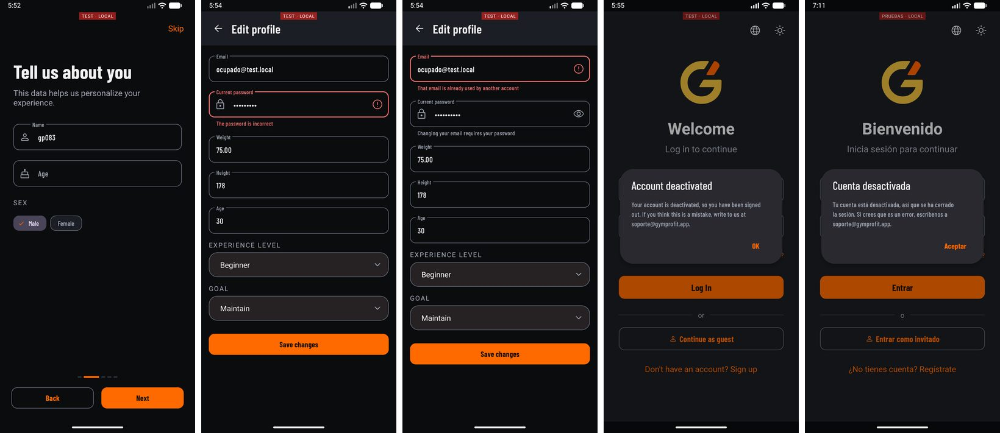

# Seguridad — GP-083, GP-076 y GP-048 (y cierre de GP-081)

Ejecutado el 2026-09-24, en el orden pedido y un commit por tarea. Antes del lote
se cerró GP-081 con la versión A del icono.

Cada comprobación nueva se validó **quitándola y viendo su test en rojo**, como en
GP-022, con un script que aplica la mutación, corre la clase de test, lee los
casos en rojo del XML de surefire y revierte. Todos los tests de acceso ajeno
levantan el contexto (`AbstractOwnershipTest`): ninguno simula el servicio.

| Commit | Qué |
|---|---|
| `7ac8e8a` | GP-081 · icono adaptativo con el logo real, versión A (`#0B0C0E` con la G de la variante oscura) |
| `8833279` | GP-083 · una cuenta desactivada deja de entrar y el correo se cambia con contraseña |
| `cd1ff75` | GP-076 · la carrera del guardado idempotente de la sesión ya no da 500 |
| `018babb` | GP-048 · cobertura IDOR de todas las rutas con id, y **cinco fallos reales** que salieron al buscar hermanos |

Tests de la API: **573 en verde** (390 al empezar el lote). Tests de la app: los
anteriores más 8 nuevos, en verde. Nada de esto cambia un contrato que usen las
builds repartidas, salvo lo que la ficha pedía cambiar (ver GP-083, punto 3).

**Fallos reales encontrados en GP-048, contados aparte más abajo:**

1. `PATCH /ejercicios/{id}` lo podía hacer **cualquier token, también el de invitado**: reescribía o desactivaba el catálogo.
2. `GET /usuarios/activos` devolvía a cualquier USER **correo, peso, altura y edad de todos los usuarios**.
3. Los **alimentos personales** de cualquier usuario salían por `GET /alimentos/{id}` y por cinco listados del catálogo, también al invitado.
4. Seis hermanos de `/rutinas-ejercicios` sin comprobación, uno de **escritura**: se borraban ejercicios de la rutina de otro.
5. `/progreso-ejercicios/ejercicio/{id}` y su contador devolvían **el progreso de todos los usuarios** en ese ejercicio.

---

## GP-081 · Icono de la app — cerrado

El propietario eligió la **A**. Se regeneró con `scripts/generar-icono-app.py`
desde `drawable-night/logo.png` con `#0B0C0E`, se cambió `ic_launcher_fondo`, la
rama se puso al día con `main` (rebase limpio), se fusionó y se borró. El commit
se reescribió para que su mensaje dijera la versión que lleva. Comprobado en el
emulador, en el dock del launcher. **Sin verificar:** el icono heredado de API
24-25, porque no hay emulador de esa versión.

---

## GP-083 · Desactivar una cuenta no la desactivaba

### Qué se hizo

1. **La cuenta desactivada deja de entrar.** El filtro JWT, tras validar firma y
   caducidad, mira `isEnabled()` y corta con **401** y `cause: CUENTA_DESACTIVADA`
   (excepción nueva, `CuentaDesactivadaException`). Corta en vez de dejar la
   petición sin autenticar: así el token tampoco sirve en rutas públicas.
   `POST /auth/refresh` hace la misma comprobación. Y desactivar —toggle, baja
   lógica o `PUT /usuarios` de administración— **revoca todos sus refresh tokens**.
   El login con contraseña **no** cambia: Spring comprueba `isEnabled()` antes que
   la contraseña, así que decir ahí «desactivada» se lo diría a quien no la sabe.
   Sigue dando el 401 genérico de credenciales.
2. **No se reactiva sola.** `activo` sale de `UsuarioPatchDTO`. Si un cliente lo
   manda, Jackson lo ignora como cualquier campo desconocido. Solo lo tocan las
   rutas de administración.
3. **El correo se cambia por su ruta.** `PUT /usuarios/me/email`, sin id: el
   usuario sale del token, exige la contraseña actual (403 si no es), valida el
   formato con `@Email` (400) y responde **409** si otra cuenta lo usa. La
   contraseña se comprueba antes que la disponibilidad, para que la ruta no sirva
   a quien no la sabe para averiguar qué correos existen. Va en el cupo estricto
   del rate limit, como el borrado de cuenta. En el `PATCH`, el email solo se
   acepta si es el actual (sin distinguir mayúsculas, como la restricción única de
   la base); distinto, 400 con un mensaje que remite al cambio de correo.
   Servicio aparte (`CambioEmailService`) por el mismo motivo que
   `BorradoCuentaService`: `UsuarioService` es el `UserDetailsService` de
   `SecurityConfig`, que define el `PasswordEncoder`.
4. **El onboarding deja de pedir el correo.** Fuera del paso 2, del borrador y del
   `PATCH` final. En editar perfil, el campo de contraseña aparece solo si el
   correo escrito no es el actual, y cada error va al campo que lo causa: 403 a la
   contraseña, 409 y 400 al correo. El login explica el cierre por cuenta
   desactivada en un diálogo, en ES y EN.

**Anotado para GP-045, no hecho:** el correo nuevo no se verifica. Tampoco se
revocan las otras sesiones al cambiar el correo ni se avisa al correo viejo:
no lo pedía la ficha y encaja mejor con la verificación.

### Criterios

| Criterio | Evidencia |
|---|---|
| El token de una cuenta desactivada recibe 401 en cualquier ruta, y su refresh también | `token_ruta_protegida_401`, `token_ruta_publica_401` (`/actuator/health`), `refresh_401` |
| Desactivar revoca sus sesiones | `toggle_revoca_refresh`: desactiva y **reactiva**, y el refresh sigue sin servir. Así lo que lo para es la revocación y no la comprobación de `activo` |
| Un PATCH con `activo` no lo cambia | `activo_false_no_cambia`, `desactivada_no_se_reactiva` |
| Un PATCH con un email distinto da 400 | `email_distinto_400`; los que las builds mandan siguen en 200: `mismo_email_200`, `mismo_email_mayusculas_200` |
| Cambiar el correo exige la contraseña, valida el formato y da 409 si está en uso | `password_incorrecta_403`, `formato_invalido_400`, `en_uso_409`, `cambia_200`, `guest_403`, `sin_token_401` |
| Tras iniciar sesión, el onboarding ni pide ni cambia el correo | Emulador: cuenta nueva, login, paso 2 sin campo de correo, asistente completo, el correo en la base sigue igual (primera captura) |
| Cada error nuevo se explica en la app, en ES y EN | Recursos en los dos idiomas. Emulador: contraseña incorrecta, correo en uso y cuenta desactivada en EN, y cuenta desactivada en ES |

Clase: `CuentaDesactivadaYCorreoTest`, 17 casos, con JWT real en la cabecera y no
`@WithUserDetails`: lo que se prueba es el propio filtro. En la app,
`EditarPerfilActivityTest` y `ApiCallbackTest` (el código se reconoce tanto en
JSON como en XML: sin cabecera `Accept`, la API responde los errores en XML).

### Validación por mutación

| Mutación | En rojo |
|---|---|
| M1 · quitar la comprobación del filtro JWT | 3: las dos de token y `desactivada_no_se_reactiva` |
| M2 · quitar la del refresh | `refresh_401` |
| M3 · no revocar al desactivar | `toggle_revoca_refresh` |
| M4 · devolver `activo` al DTO y aplicarlo | `activo_false_no_cambia` |
| M5 · quitar la comprobación del email en el PATCH | `email_distinto_400` |
| M6 · no comprobar la contraseña del cambio de correo | `password_incorrecta_403` |
| M7 · quitar `@Email` | `formato_invalido_400` |
| M8a · quitar la comprobación previa del correo en uso | ninguno por el 409: lo sigue dando el `catch` de la restricción única. Rojo solo el paso de relectura del test, porque la transacción del test queda inservible |
| M8b · quitar la comprobación previa **y** el `catch` | `en_uso_409` |
| M9 · abrir la ruta a cualquier autenticado | `guest_403` |
| M10 · sacar la ruta del cupo estricto | `cambio_de_correo_va_al_cupo_estricto` |

M8a dice algo útil: el 409 tiene dos defensas y el test solo detecta que falten
las dos. El comentario del código lo dice así, y dice también que la carrera de
dos cambios simultáneos al mismo correo no tiene test.

---

## GP-076 · La recuperación de la carrera no funcionaba

`guardarCompleta` atrapaba `DataIntegrityViolationException` dentro de su propia
transacción y releía. No podía salir bien, y el test nuevo lo enseña con el
código de antes: la perdedora recibía **500**. En el log, Hibernate lo dice solo:
`Entry for instance of SesionEntrenamiento has a null identifier (this can happen
if the session is flushed after an exception occurs)`.

**Arreglo.** El `catch` sale de la transacción. `GuardadoSesionCompletaService` es
una fachada **sin** `@Transactional`: cuando le llega la excepción, la
transacción fallida ya se ha revertido entera, y relee con
`buscarPorClaveIdempotencia`, que abre una transacción nueva de solo lectura con
su propia instantánea. Fuera el `flush()` y su comentario: con `IDENTITY` el
`INSERT` sale en `save()`.

**Test.** `GuardadoSesionCompletaCarreraTest`, no transaccional. Un
`BeanPostProcessor` envuelve el repositorio de sesiones en un proxy que hace
esperar en una barrera, **justo después** de la comprobación previa, a las dos
primeras llamadas: ninguna petición inserta hasta que las dos han mirado y no han
visto nada. La tercera llamada, la relectura, pasa sin esperar. Resultado:

| Código | Resultado del test |
|---|---|
| Antes del arreglo | rojo: una 200, la otra **500** |
| Con el arreglo | verde: las dos 200, el mismo id, una sola sesión |
| Con la fachada anotada `@Transactional` | rojo |
| Sin el `catch` de la fachada | rojo |

Tres pasadas seguidas en verde: no es intermitente. Smoke por HTTP contra la API
local: dos peticiones seguidas con la misma clave, las dos 200 con el mismo id. La
simultaneidad solo la prueba el test: a mano no se puede forzar.

**Ningún comentario afirma lo que un test no demuestra.** El de
`buscarPorClaveIdempotencia` dice que `REQUIRES_NEW` hoy equivale a `REQUIRED`
—la fachada no tiene transacción— y que el caso en que importaría no tiene test.

---

## GP-048 · Cobertura IDOR de las rutas que nunca se habían probado

### Método

1. **Inventario automático.** Un script cruza las 156 rutas con variable de los
   controladores con las peticiones de los tests de integración. Al empezar: **111
   rutas con id sin ningún test**, y muchas de las restantes solo tocadas por
   tests que no son de propiedad (contrato de lista vacía, calorías).
2. **Caza de hermanos.** Otro script lista, servicio a servicio, los métodos
   públicos sin ninguna comprobación. Cada uno se leyó, y cada regla de
   `SecurityConfig` se cruzó con los verbos que existen. De ahí salieron los cinco
   fallos de más abajo.
3. **Tests por familia, parametrizados.** Una plantilla por ruta
   (`"GET /sesiones/usuario/{owner}"`), con JWT real en la cabecera. Para cada una,
   según quién es el dueño del id (DEC-027):
   - **id con dueño** → el atacante recibe 403 **y el dueño no**, que es lo que
     impide que el test pase por un 403 que venga de otra parte;
   - **listado global** → un USER recibe 403 y ADMIN no;
   - **id del catálogo** → no hay 403 que dar: el atacante no ve nada del otro;
   - **ids en el cuerpo** de un `POST` o un `PUT` → mismo criterio que en la ruta;
   - **regla de rol** → el invitado pide **su propio** id, para que la propiedad se
     cumpla y lo único que pueda rechazarlo sea `SecurityConfig`.
4. **Mutación por familia.** Se quitan a la vez todas las comprobaciones del
   servicio de esa familia y se exige que **todos** sus casos se pongan en rojo;
   luego, las comprobaciones sueltas que tienen un test propio. Como cada ruta
   pasa por un solo método de servicio, que su caso se ponga rojo al quitar las
   del servicio es lo mismo que ponerse rojo al quitar la suya.

### Clases

Nuevas: `SesionOwnershipTest` (26 casos), `ObjetivoPersonalOwnershipTest` (16),
`RutinaOwnershipTest` (19), `UsuarioOwnershipTest` (23),
`AlimentoVisibilidadTest` (16), `CatalogoEscrituraTest` (9). Ampliadas, con las
rutas que les faltaban: comidas, alimentos-comida, mediciones, notificaciones,
progreso, ejercicios realizados y rutinas-ejercicios. `AbstractOwnershipTest`
gana `pedir`, `estado`, `rellenar` y `token`.

**`POST /sesiones/completa`**, la ruta que nació sin test: con la rutina de otro,
**403 y ninguna fila**; con una plantilla sin dueño, 200; con una rutina que no
existe, 404; y quitando `checkRutinaUtilizable` el 403 se pone rojo (S2).

### Validación por mutación

| Mutación | Rojos / casos | Lo que tenía que ponerse rojo |
|---|---|---|
| S1 · `SesionEntrenamientoService` sin comprobaciones | 22 / 26 | los 14 de id ajeno, los 6 de ADMIN, el PUT con id ajeno y `/completa` con rutina ajena |
| S2 · sin `checkRutinaUtilizable` | 1 | `/completa` con rutina ajena |
| S3 · el `usuarioId` del cuerpo manda | 1 | el POST queda del token |
| S4 · `/sesiones/**` abierto a GUEST | 1 | GUEST con su propio id |
| O1 · `ObjetivoPersonalService` sin comprobaciones | 14 / 16 | id ajeno, ADMIN y PUT |
| O2 · el `usuarioId` del cuerpo manda | 1 | POST |
| O3 · regla de rol | 1 | GUEST |
| R1 · `RutinaService` sin su comprobación a mano (`canView`, `checkOwnership`, `filterViewable`, la del alta) | 17 / 19 | id ajeno, predefinidas, listado global, aislamiento, PUT y POST para otro |
| R2 · `POST /rutinas` abierto a GUEST | 1 | GUEST no crea |
| U1 · `UsuarioService` sin comprobaciones | 6 / 23 | perfil ajeno y `/usuarios/activos` |
| U2 · `/admin/**` abierto | 4 | rol, toggle-activo, listado y estadísticas |
| U3 · `/usuarios/**` abierto | 7 | el resto de rutas de administración |
| U4 · `/jooq/usuarios/**` sin regla ni `@PreAuthorize` | 1 | la ruta jOOQ |
| U5 · reglas del perfil abiertas a GUEST | 4 | los cuatro de GUEST |
| C1 · `ComidaService` | 14 / 16 | id ajeno, ADMIN y PUT |
| C2 · `AlimentoComidaService` | 12 / 16 | los nuevos |
| C3 · `MedicionCorporalService` | 9 / 11 | id ajeno, ADMIN y PUT |
| C4 · `NotificacionService` | 15 / 17 | id ajeno y ADMIN |
| C5 · `ProgresoEjercicioService` | 15 / 19 | id ajeno, ADMIN y PUT |
| C6 · `EjercicioRealizadoService` | 12 / 19 | id ajeno, ADMIN, PUT y POST en sesión ajena |
| C7 · `RutinaEjercicioService` | 6 / 18 | id ajeno, ADMIN, PUT y POST en rutina ajena |
| C8 · alimentos sin `checkPuedeEscribir` | 8 / 16 | escritura ajena y de catálogo |
| C9 · reglas de escritura del catálogo abiertas | 9 / 9 | todas |
| C10 · reglas de rol de comidas, mediciones, notificaciones y progreso | 4 | los cuatro de GUEST |
| C11 · subir foto sin comprobar | 1 | foto ajena |

Ninguna mutación dejó en verde un caso que tenía que ponerse rojo.

---

## Fallos reales encontrados al buscar hermanos

Los cinco se arreglan en el mismo commit de GP-048, cada uno con su test, y cada
test se vio en rojo **quitando el arreglo** (F1 a F4; el quinto es parte de U1).
Todos se reprodujeron antes por HTTP contra la API local, y después se comprobó
que ya no pasan.

### 1. `PATCH /ejercicios/{id}` abierto a cualquier token — grave

`SecurityConfig` tenía reglas de ADMIN para `POST`, `PUT` y `DELETE` de
`/ejercicios/**`, y ninguna para `PATCH`. Caía en `anyRequest().authenticated()`, y
`EjercicioService.patch` no comprueba nada. Con el token de `POST /auth/guest`,
que se pide sin credenciales, se podía renombrar o desactivar cualquiera de los
873 ejercicios del catálogo. Reproducido: invitado, `PATCH /ejercicios/999999`
→ 404, es decir, pasó la autorización. **Arreglo:** la regla que faltaba.
**Test:** `CatalogoEscrituraTest` (F1: rojo sin la regla, también el caso que
comprueba que el ejercicio no cambia).

`PATCH /rutinas/**` tampoco tiene regla, pero ahí `RutinaService` sí comprueba
propiedad (el invitado recibe 403). No se ha añadido regla: no se podría probar
que sirva de algo, y queda anotado.

### 2. `GET /usuarios/activos` para cualquier USER — grave

La regla `GET /usuarios/{id}`, pensada para el perfil propio, **casa también con
el literal `activos`**, y `findActivos` no comprobaba nada. Reproducido con una
cuenta normal: 200 con los 12 usuarios activos, cada uno con correo, peso,
altura, edad, nivel y objetivo. **Arreglo:** `requireAdmin()` en el servicio,
como el resto de listados globales. **Test:** `UsuarioOwnershipTest` (U1).

### 3. Los alimentos personales salían del catálogo — grave

`/alimentos/usuario/{id}` se cerró el 2026-09-19, pero los alimentos personales
salían igual por `GET /alimentos/{id}`, `/alimentos`, `/nombre/{n}`,
`/categoria/{c}`, `/activos` y `/calorias`, y los contadores los contaban. A
cualquiera, también al invitado. Reproducido: alimento «Dieta secreta» creado por
una cuenta, leído por un invitado por id y en cuatro listados. **Arreglo:** por
id, 403 si tiene dueño y no es el tuyo (`checkOwnershipIfOwned`); los listados y
contadores filtran a catálogo más los propios; ADMIN ve todo.
**Test:** `AlimentoVisibilidadTest` (F4: 8 casos en rojo sin el arreglo).

### 4. Seis hermanos de `/rutinas-ejercicios` — grave por el `DELETE`

`findByRutinaId` y los demás comprobaban, pero no estos:

| Ruta | Qué dejaba hacer |
|---|---|
| `DELETE /rutinas-ejercicios/rutina/{r}/ejercicio/{e}` | **borrar ejercicios de la rutina de otro**, y de las predefinidas |
| `GET /rutinas-ejercicios/rutina/{r}/ejercicio/{e}` | leer series, repeticiones y peso de una rutina privada ajena |
| `GET …/count/rutina/{r}` y `…/exists/rutina/{r}/ejercicio/{e}` | reconstruir una rutina ajena a base de contadores y síes |
| `GET …/ejercicio/{e}` y `…/count/ejercicio/{e}` | listar, desde un ejercicio del catálogo, las rutinas privadas de todos que lo contienen |

**Arreglo:** los cuatro primeros cargan la rutina (404 si no existe, DEC-033) y
pasan por la comprobación de su hermano; los dos por ejercicio filtran a las
rutinas que el usuario puede leer. **Test:** `RutinaEjercicioOwnershipTest`
(F2a y F2b). La app usa el `DELETE` para quitar un ejercicio de su propia rutina:
comprobado por HTTP que el dueño sigue pudiendo y otro usuario recibe 403.

### 5. Progreso por ejercicio del catálogo

`GET /progreso-ejercicios/ejercicio/{id}` y su contador devolvían el progreso de
**todos** los usuarios en ese ejercicio: mejor peso, repeticiones, fechas y
`usuarioId`. Es el mismo defecto que se cerró en ejercicios realizados el
2026-09-19, en el servicio de al lado. **Arreglo:** el mismo, filtrar por el
usuario del token; ADMIN conserva la vista global. **Test:**
`ProgresoEjercicioOwnershipTest` (F3).

---

## Inventario de rutas con id

Las 156 rutas con variable de ruta, con la clase que prueba su acceso ajeno. Las
rutas que solo tocaban tests de otra cosa (contrato de lista vacía, calorías,
i18n) cuentan como sin test, salvo `GET /ejercicios/{id}`: es catálogo público,
el mismo para todos, y no hay nada ajeno que aislar.

Cinco quedan sin test de acceso ajeno, y no es un hueco: son **filtros del
catálogo público por enum o texto** (grupo muscular, dificultad, nombre, filtro
jOOQ, predefinidas por nivel). Devuelven lo mismo a cualquiera y no llevan datos
de usuario.

Además de las rutas con variable, tienen test las escrituras que llevan el id **en
el cuerpo**: `PUT` de sesiones, objetivos, rutinas, comidas, mediciones,
progreso, ejercicios realizados, rutinas-ejercicios y alimentos-comida;
`POST /sesiones/completa`, `/ejercicios-realizados`, `/rutinas-ejercicios` y
`/alimentos-comida` con el padre de otro; y `POST` de sesiones, objetivos y
rutinas con el `usuarioId` de otro.

| Verbo | Ruta | Test de acceso ajeno |
|---|---|---|
| PATCH | `/admin/usuarios/{id}/toggle-activo` | CuentaDesactivadaYCorreoTest, UsuarioOwnershipTest |
| PATCH | `/admin/usuarios/{id}/rol` | UsuarioOwnershipTest |
| GET | `/alimentos-comida/{id}` | AlimentoComidaOwnershipTest |
| DELETE | `/alimentos-comida/{id}` | AlimentoComidaOwnershipTest |
| GET | `/alimentos-comida/comida/{comidaId}` | AlimentoComidaOwnershipTest |
| GET | `/alimentos-comida/alimento/{alimentoId}` | AlimentoComidaOwnershipTest |
| GET | `/alimentos-comida/comida/{comidaId}/alimento/{alimentoId}` | AlimentoComidaOwnershipTest |
| DELETE | `/alimentos-comida/comida/{comidaId}` | AlimentoComidaOwnershipTest |
| DELETE | `/alimentos-comida/comida/{comidaId}/alimento/{alimentoId}` | AlimentoComidaOwnershipTest |
| GET | `/alimentos-comida/exists/comida/{comidaId}/alimento/{alimentoId}` | AlimentoComidaOwnershipTest |
| GET | `/alimentos-comida/count/comida/{comidaId}` | AlimentoComidaOwnershipTest |
| GET | `/alimentos-comida/count/alimento/{alimentoId}` | AlimentoComidaOwnershipTest |
| PATCH | `/alimentos-comida/{id}` | AlimentoComidaOwnershipTest |
| GET | `/alimentos/{id}` | AlimentoOwnershipTest, AlimentoVisibilidadTest |
| DELETE | `/alimentos/{id}` | AlimentoVisibilidadTest |
| PUT | `/alimentos/{id}/activar` | AlimentoVisibilidadTest |
| DELETE | `/alimentos/{id}/permanente` | AlimentoVisibilidadTest |
| GET | `/alimentos/nombre/{nombre}` | AlimentoVisibilidadTest |
| GET | `/alimentos/categoria/{categoria}` | AlimentoVisibilidadTest |
| GET | `/alimentos/count/categoria/{categoria}` | AlimentoVisibilidadTest |
| GET | `/alimentos/usuario/{usuarioId}` | AlimentoOwnershipTest |
| PATCH | `/alimentos/{id}` | AlimentoVisibilidadTest |
| GET | `/comidas/{id}` | ComidaOwnershipTest |
| DELETE | `/comidas/{id}` | ComidaOwnershipTest |
| GET | `/comidas/usuario/{usuarioId}` | ComidaOwnershipTest |
| GET | `/comidas/tipo/{tipoComida}` | ComidaOwnershipTest |
| GET | `/comidas/fecha/{fecha}` | ComidaOwnershipTest |
| GET | `/comidas/usuario/{usuarioId}/fecha/{fecha}` | ComidaOwnershipTest |
| GET | `/comidas/usuario/{usuarioId}/resumen` | ComidaOwnershipTest |
| GET | `/comidas/usuario/{usuarioId}/tipo/{tipoComida}` | ComidaOwnershipTest |
| GET | `/comidas/count/usuario/{usuarioId}` | ComidaOwnershipTest |
| GET | `/comidas/count/tipo/{tipoComida}` | ComidaOwnershipTest |
| GET | `/comidas/count/usuario/{usuarioId}/tipo/{tipoComida}` | ComidaOwnershipTest |
| PATCH | `/comidas/{id}` | ComidaOwnershipTest |
| GET | `/ejercicios/{id}` | CatalogoI18nTest, SinCaloriasEntrenamientoTest |
| DELETE | `/ejercicios/{id}` | CatalogoEscrituraTest |
| PUT | `/ejercicios/{id}/activar` | CatalogoEscrituraTest |
| DELETE | `/ejercicios/{id}/permanente` | CatalogoEscrituraTest |
| GET | `/ejercicios/grupo/{grupoMuscular}` | — filtro de catálogo público por enum o texto: no es id de recurso (ver nota) |
| GET | `/ejercicios/dificultad/{dificultad}` | — filtro de catálogo público por enum o texto: no es id de recurso (ver nota) |
| GET | `/ejercicios/nombre/{nombre}` | — filtro de catálogo público por enum o texto: no es id de recurso (ver nota) |
| PATCH | `/ejercicios/{id}` | CatalogoEscrituraTest |
| GET | `/jooq/ejercicios/filtro/{grupoMuscular}/{dificultad}` | — filtro de catálogo público por enum o texto: no es id de recurso (ver nota) |
| GET | `/ejercicios-realizados/{id}` | EjercicioRealizadoOwnershipTest |
| DELETE | `/ejercicios-realizados/{id}` | EjercicioRealizadoOwnershipTest |
| GET | `/ejercicios-realizados/sesion/{sesionId}` | EjercicioRealizadoOwnershipTest |
| GET | `/ejercicios-realizados/ejercicio/{ejercicioId}` | EjercicioRealizadoOwnershipTest |
| GET | `/ejercicios-realizados/sesion/{sesionId}/ejercicio/{ejercicioId}` | EjercicioRealizadoOwnershipTest |
| GET | `/ejercicios-realizados/count/sesion/{sesionId}` | EjercicioRealizadoOwnershipTest |
| GET | `/ejercicios-realizados/count/ejercicio/{ejercicioId}` | EjercicioRealizadoOwnershipTest |
| GET | `/ejercicios-realizados/exists/sesion/{sesionId}/ejercicio/{ejercicioId}` | EjercicioRealizadoOwnershipTest |
| DELETE | `/ejercicios-realizados/sesion/{sesionId}` | EjercicioRealizadoOwnershipTest |
| DELETE | `/ejercicios-realizados/sesion/{sesionId}/ejercicio/{ejercicioId}` | EjercicioRealizadoOwnershipTest |
| PATCH | `/ejercicios-realizados/{id}` | EjercicioRealizadoOwnershipTest |
| GET | `/logros/usuario/{usuarioId}` | LogroOwnershipTest |
| PUT | `/logros/{id}` | CatalogoEscrituraTest |
| GET | `/mediciones-corporales/{id}` | MedicionCorporalOwnershipTest |
| DELETE | `/mediciones-corporales/{id}` | MedicionCorporalOwnershipTest |
| GET | `/mediciones-corporales/usuario/{usuarioId}` | MedicionCorporalOwnershipTest |
| GET | `/mediciones-corporales/usuario/{usuarioId}/ordenadas` | MedicionCorporalOwnershipTest |
| GET | `/mediciones-corporales/usuario/{usuarioId}/rango` | MedicionCorporalOwnershipTest |
| GET | `/mediciones-corporales/usuario/{usuarioId}/ultimas` | MedicionCorporalOwnershipTest |
| PATCH | `/mediciones-corporales/{id}` | MedicionCorporalOwnershipTest |
| GET | `/notificaciones/{id}` | NotificacionOwnershipTest |
| DELETE | `/notificaciones/{id}` | NotificacionOwnershipTest |
| GET | `/notificaciones/usuario/{usuarioId}` | NotificacionOwnershipTest |
| GET | `/notificaciones/usuario/{usuarioId}/ordenadas` | NotificacionOwnershipTest |
| GET | `/notificaciones/usuario/{usuarioId}/no-leidas` | NotificacionOwnershipTest |
| GET | `/notificaciones/usuario/{usuarioId}/leidas` | NotificacionOwnershipTest |
| GET | `/notificaciones/usuario/{usuarioId}/tipo/{tipo}` | NotificacionOwnershipTest |
| PUT | `/notificaciones/{id}/leer` | NotificacionOwnershipTest |
| PUT | `/notificaciones/usuario/{usuarioId}/leer-todas` | NotificacionOwnershipTest |
| DELETE | `/notificaciones/usuario/{usuarioId}` | NotificacionOwnershipTest |
| GET | `/notificaciones/count/usuario/{usuarioId}` | NotificacionOwnershipTest |
| GET | `/notificaciones/count/usuario/{usuarioId}/no-leidas` | NotificacionOwnershipTest |
| GET | `/notificaciones/exists/usuario/{usuarioId}/no-leidas` | NotificacionOwnershipTest |
| PATCH | `/notificaciones/{id}` | NotificacionOwnershipTest |
| GET | `/objetivos-personales/{id}` | ObjetivoPersonalOwnershipTest |
| DELETE | `/objetivos-personales/{id}` | ObjetivoPersonalOwnershipTest |
| GET | `/objetivos-personales/usuario/{usuarioId}` | ObjetivoPersonalOwnershipTest |
| GET | `/objetivos-personales/usuario/{usuarioId}/ordenados` | ObjetivoPersonalOwnershipTest |
| GET | `/objetivos-personales/usuario/{usuarioId}/pendientes` | ObjetivoPersonalOwnershipTest |
| GET | `/objetivos-personales/usuario/{usuarioId}/completados` | ObjetivoPersonalOwnershipTest |
| GET | `/objetivos-personales/tipo/{tipoObjetivo}` | ObjetivoPersonalOwnershipTest |
| PUT | `/objetivos-personales/{id}/completar` | ObjetivoPersonalOwnershipTest |
| GET | `/objetivos-personales/count/usuario/{usuarioId}` | ObjetivoPersonalOwnershipTest |
| GET | `/objetivos-personales/count/usuario/{usuarioId}/completados` | ObjetivoPersonalOwnershipTest |
| GET | `/objetivos-personales/count/usuario/{usuarioId}/pendientes` | ObjetivoPersonalOwnershipTest |
| PATCH | `/objetivos-personales/{id}` | ObjetivoPersonalOwnershipTest |
| GET | `/progreso-ejercicios/{id}` | ProgresoEjercicioOwnershipTest |
| DELETE | `/progreso-ejercicios/{id}` | ProgresoEjercicioOwnershipTest |
| GET | `/progreso-ejercicios/usuario/{usuarioId}` | ProgresoEjercicioOwnershipTest |
| GET | `/progreso-ejercicios/ejercicio/{ejercicioId}` | ProgresoEjercicioOwnershipTest |
| GET | `/progreso-ejercicios/usuario/{usuarioId}/ordenados` | ProgresoEjercicioOwnershipTest |
| GET | `/progreso-ejercicios/usuario/{usuarioId}/ejercicio/{ejercicioId}` | ProgresoEjercicioOwnershipTest |
| GET | `/progreso-ejercicios/usuario/{usuarioId}/ejercicio/{ejercicioId}/historial` | ProgresoEjercicioOwnershipTest |
| GET | `/progreso-ejercicios/usuario/{usuarioId}/ejercicio/{ejercicioId}/ultimo` | ProgresoEjercicioOwnershipTest |
| GET | `/progreso-ejercicios/count/usuario/{usuarioId}` | ProgresoEjercicioOwnershipTest |
| GET | `/progreso-ejercicios/count/ejercicio/{ejercicioId}` | ProgresoEjercicioOwnershipTest |
| GET | `/progreso-ejercicios/exists/usuario/{usuarioId}/ejercicio/{ejercicioId}` | ProgresoEjercicioOwnershipTest |
| DELETE | `/progreso-ejercicios/usuario/{usuarioId}` | ProgresoEjercicioOwnershipTest |
| DELETE | `/progreso-ejercicios/usuario/{usuarioId}/ejercicio/{ejercicioId}` | ProgresoEjercicioOwnershipTest |
| PATCH | `/progreso-ejercicios/{id}` | ProgresoEjercicioOwnershipTest |
| GET | `/progreso-ejercicios/usuario/{usuarioId}/record-destacado` | ProgresoEjercicioOwnershipTest |
| GET | `/rutinas/{id}` | RutinaOwnershipTest |
| DELETE | `/rutinas/{id}` | RutinaOwnershipTest |
| PUT | `/rutinas/{id}/activar` | RutinaOwnershipTest |
| DELETE | `/rutinas/{id}/permanente` | RutinaOwnershipTest |
| GET | `/rutinas/usuario/{usuarioId}` | RutinaOwnershipTest |
| GET | `/rutinas/nivel/{nivel}` | RutinaOwnershipTest |
| GET | `/rutinas/nombre/{nombre}` | RutinaOwnershipTest |
| GET | `/rutinas/usuario/{usuarioId}/activas` | RutinaOwnershipTest |
| GET | `/rutinas/predefinidas/nivel/{nivel}` | — filtro de catálogo público por enum o texto: no es id de recurso (ver nota) |
| PATCH | `/rutinas/{id}` | RutinaOwnershipTest |
| GET | `/rutinas-ejercicios/{id}` | RutinaEjercicioOwnershipTest |
| DELETE | `/rutinas-ejercicios/{id}` | RutinaEjercicioOwnershipTest |
| GET | `/rutinas-ejercicios/rutina/{rutinaId}` | RutinaEjercicioOwnershipTest |
| GET | `/rutinas-ejercicios/rutina/{rutinaId}/ordenados` | RutinaEjercicioOwnershipTest |
| GET | `/rutinas-ejercicios/ejercicio/{ejercicioId}` | RutinaEjercicioOwnershipTest |
| GET | `/rutinas-ejercicios/rutina/{rutinaId}/ejercicio/{ejercicioId}` | RutinaEjercicioOwnershipTest |
| GET | `/rutinas-ejercicios/count/rutina/{rutinaId}` | RutinaEjercicioOwnershipTest |
| GET | `/rutinas-ejercicios/count/ejercicio/{ejercicioId}` | RutinaEjercicioOwnershipTest |
| GET | `/rutinas-ejercicios/exists/rutina/{rutinaId}/ejercicio/{ejercicioId}` | RutinaEjercicioOwnershipTest |
| DELETE | `/rutinas-ejercicios/rutina/{rutinaId}` | RutinaEjercicioOwnershipTest |
| DELETE | `/rutinas-ejercicios/rutina/{rutinaId}/ejercicio/{ejercicioId}` | RutinaEjercicioOwnershipTest |
| PATCH | `/rutinas-ejercicios/{id}` | RutinaEjercicioOwnershipTest |
| GET | `/sesiones/{id}` | SesionOwnershipTest |
| DELETE | `/sesiones/{id}` | SesionOwnershipTest |
| PUT | `/sesiones/{id}/completar` | SesionOwnershipTest |
| GET | `/sesiones/usuario/{usuarioId}` | SesionOwnershipTest |
| GET | `/sesiones/rutina/{rutinaId}` | SesionOwnershipTest |
| GET | `/sesiones/usuario/{usuarioId}/completadas` | SesionOwnershipTest |
| GET | `/sesiones/usuario/{usuarioId}/pendientes` | SesionOwnershipTest |
| GET | `/sesiones/usuario/{usuarioId}/fecha/{fecha}` | SesionOwnershipTest |
| GET | `/sesiones/fecha/{fecha}` | SesionOwnershipTest |
| GET | `/sesiones/usuario/{usuarioId}/rutina/{rutinaId}` | SesionOwnershipTest |
| GET | `/sesiones/count/usuario/{usuarioId}` | SesionOwnershipTest |
| GET | `/sesiones/count/rutina/{rutinaId}` | SesionOwnershipTest |
| GET | `/sesiones/usuario/{usuarioId}/ordenadas` | SesionOwnershipTest |
| GET | `/sesiones/usuario/{usuarioId}/completadas/ordenadas` | SesionOwnershipTest |
| PATCH | `/sesiones/{id}` | SesionOwnershipTest, ValoracionSesionTest |
| GET | `/sesiones/usuario/{usuarioId}/volumen-muscular` | SesionOwnershipTest |
| GET | `/sesiones/{id}/volumen` | SesionOwnershipTest |
| GET | `/usuarios/{id}` | CuentaDesactivadaYCorreoTest, UsuarioOwnershipTest |
| DELETE | `/usuarios/{id}` | BorradoCuentaTest, UsuarioOwnershipTest |
| PUT | `/usuarios/{id}/activar` | UsuarioOwnershipTest |
| DELETE | `/usuarios/{id}/permanente` | UsuarioOwnershipTest |
| GET | `/usuarios/username/{username}` | UsuarioOwnershipTest |
| GET | `/usuarios/email/{email}` | UsuarioOwnershipTest |
| GET | `/usuarios/exists/username/{username}` | UsuarioOwnershipTest |
| GET | `/usuarios/exists/email/{email}` | UsuarioOwnershipTest |
| PATCH | `/usuarios/{id}` | CuentaDesactivadaYCorreoTest, UsuarioOwnershipTest |
| POST | `/usuarios/{id}/foto` | UsuarioOwnershipTest, FotoPerfilTest |
| GET | `/usuarios/{id}/foto` | FotoPerfilTest, UsuarioOwnershipTest |
| GET | `/usuarios/{id}/estadisticas` | UsuarioOwnershipTest |
| GET | `/jooq/usuarios/nivel/{nivelExperiencia}` | UsuarioOwnershipTest |

---

## Visto de paso y no arreglado

- **`PUT /comidas` sin `tipoComida` da 500**, no 400: `validarTipoComida` del
  controlador hace `toUpperCase()` sobre null. Apareció al escribir el test del
  PUT con id ajeno.
- **`POST /rutinas` sin `nivel`** no crea la rutina y no devuelve un error claro;
  y `GET /rutinas-ejercicios/count/rutina/` con el id vacío da 500. Vistos en el
  smoke, sin investigar.
- **Sin cabecera `Accept`, la API responde los errores en XML**
  (`jackson-dataformat-xml` está en el classpath). OkHttp no la manda, así que la
  app recibe XML en los cuerpos de error. Por eso la app reconoce la cuenta
  desactivada buscando el código en el texto y no parseando JSON.
- **`/usuarios/exists/username/{u}` y `/exists/email/{e}` son solo de ADMIN**
  por la regla general de `/usuarios/**`. Si algún cliente los usara para validar
  el registro, no le funcionarían. La app no los llama.
- **`PATCH /rutinas/**` no tiene regla** en `SecurityConfig` (ver fallo 1); la
  protege el servicio.
- **La regla `GET /usuarios/{id}` casa con cualquier literal de un segmento.**
  Hoy el único era `activos` (fallo 2). Una ruta nueva de ese estilo heredaría el
  acceso de USER sin que nadie lo decida.

## Pendiente

- **Desplegar y confirmar.** Todo esto está en `main` y `render.yaml` tiene
  `autoDeploy`. La confirmación del despliegue sigue el procedimiento de la
  memoria: el `health` en verde no dice qué versión corre.
- **Builds repartidas.** Tras el despliegue, una build vieja que guarde el perfil
  sigue funcionando (manda el correo actual); una que intente cambiar el correo
  desde editar perfil recibe 400 y un error genérico. Las que se repartan desde
  ahora ya usan la ruta nueva.
- **GP-045:** verificar el correo nuevo, y con él decidir si se revocan las
  sesiones y se avisa al correo viejo.
