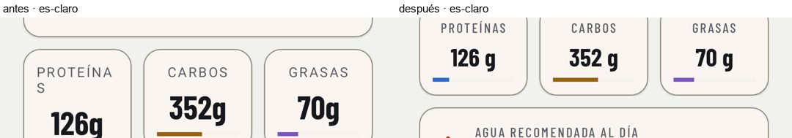
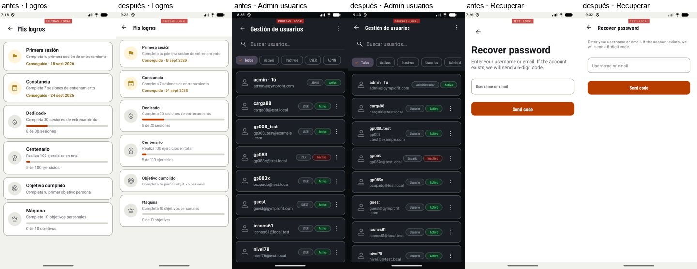
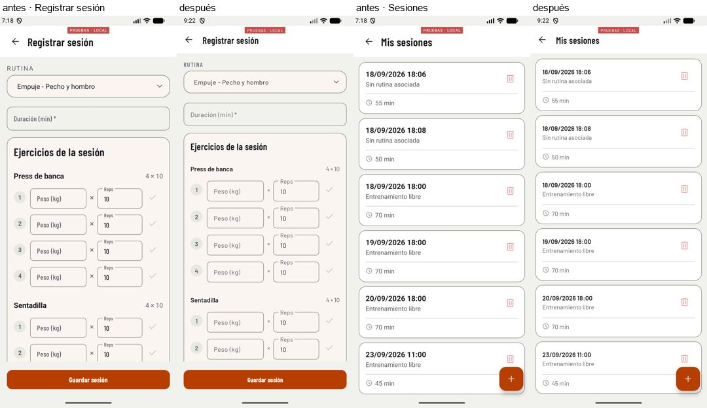
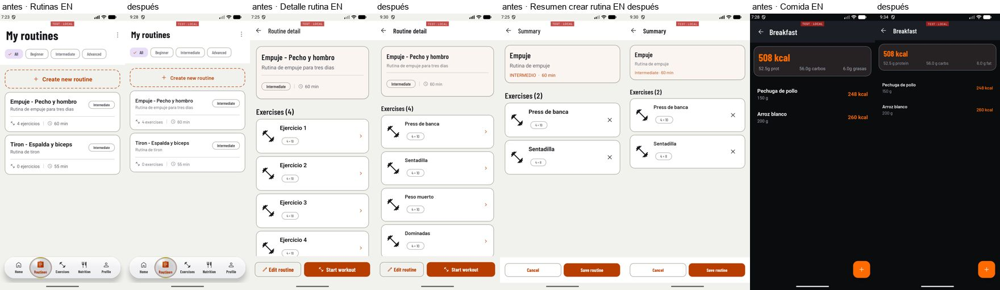
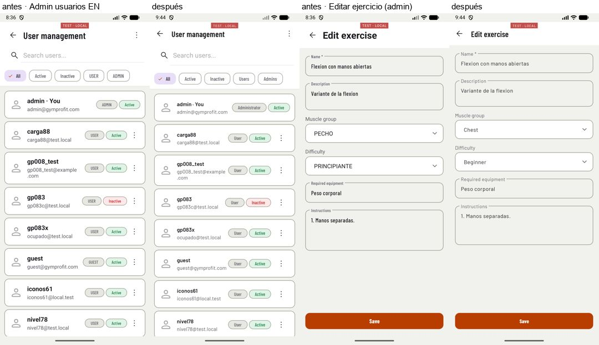
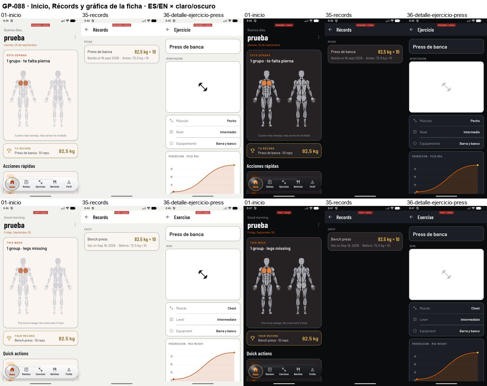
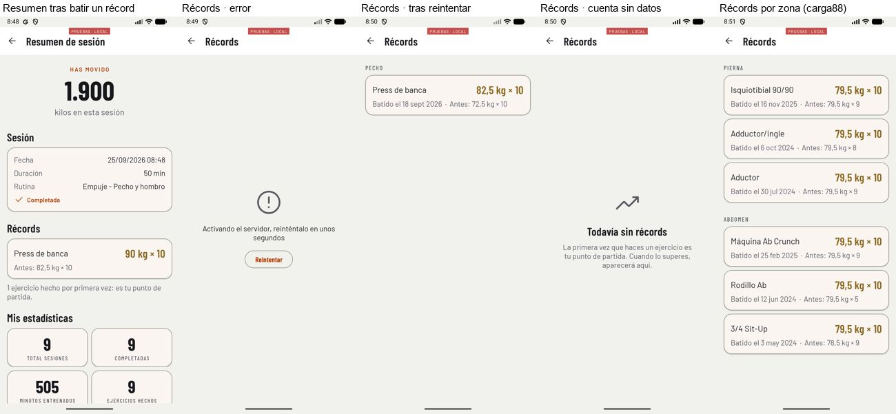

# Bloque de diseño 2c — GP-089, GP-062, GP-071 y GP-088

Informe final del bloque. El del 2026-09-24
([`2026-09-24-bloque-diseno-2c.md`](2026-09-24-bloque-diseno-2c.md)) es el corte a
mitad de sesión y queda como foto de aquel momento.

Ejecutado el 2026-09-25. Emulador `Medium_Phone_API_36.1` contra la API local.
Todo se comprobó en ejecución. «Antes» es `9ca07d3` (el último commit anterior al
bloque), compilado desde un worktree con las herramientas de depuración copiadas;
«después» es `main` al cerrar. Láminas en [`bloque-diseno-2c/`](bloque-diseno-2c/);
las capturas originales (unas 400) se quedan fuera del repositorio por tamaño.

| Commit | Qué |
|---|---|
| `ea84b4c` | **Previo**: `main` no compilaba. `3de9436` había borrado ocho ficheros de la API |
| `55db41a` | CLAUDE.md: cada commit lleva solo los ficheros de su tarea |
| `eadb19f` | GP-062 · una sola cabecera y 48 dp en todo lo pulsable |
| `1a48873` | **Fallo encontrado**: borrar una sesión con ejercicios daba 500 |
| `11b1348` | GP-071 · ni códigos de la API ni unidades a fuego en pantalla |
| `7b6f29b` | GP-089 · las etiquetas en mayúsculas también van en condensada |
| `ce1d3a6` | GP-089 · «Carbohidratos» ya no se parte con la letra grande |
| `996cfd0` | GP-062 · los pulsables sin medida escrita también llegan a 48 dp |
| `ed9237c` | GP-062 · el campo de los buscadores de administración mide 48 dp |
| `61b1afb` | GP-071 · los filtros de rol dicen el rol, no el código |
| `c21b9a7` | GP-088 · los récords salen de las series de las sesiones |
| `6921083` | **Pedido durante el bloque**: la letra baja a una escala más contenida y regular |

API: 580 tests en verde. App: 67. Tests nuevos: `CabeceraTest`, `TextoAFuegoTest`,
`ZonasTest`, `RecordsTest`, `CalculadoraRecordsTest`, una regla más en
`TipografiaTest` y el caso de borrado en `GuardadoSesionCompletaTest`. Cada test
nuevo de la app se comprobó **rojo contra el código anterior** antes de darlo por
bueno (cifras en cada apartado).

Todas las pantallas, antes y después, en las cuatro combinaciones:

- ES claro: [antes](bloque-diseno-2c/todas-antes-es-claro.jpg) · [después](bloque-diseno-2c/todas-despues-es-claro.jpg)
- ES oscuro: [antes](bloque-diseno-2c/todas-antes-es-oscuro.jpg) · [después](bloque-diseno-2c/todas-despues-es-oscuro.jpg)
- EN claro: [antes](bloque-diseno-2c/todas-antes-en-claro.jpg) · [después](bloque-diseno-2c/todas-despues-en-claro.jpg)
- EN oscuro: [antes](bloque-diseno-2c/todas-antes-en-oscuro.jpg) · [después](bloque-diseno-2c/todas-despues-en-oscuro.jpg)

Son las 34 pantallas del usuario y las 7 de administración, abiertas con el
trampolín de depuración (`TrampolinActivity`) y la cuenta `prueba` o `admin`. Faltan
Splash y Licencias: la primera redirige y la segunda recibe sus textos como
identificadores de recurso, que no se pueden pasar por adb.

Las láminas de «después» están tomadas **con la escala de letra nueva** (`6921083`,
abajo); las de GP-088 del apartado de récords, con la anterior.

---

## Antes de empezar: `main` no compilaba

`3de9436`, el commit de tipografía, se llevó por un `git add` de más ocho ficheros de
la API que eran trabajo a medias de GP-088; `ProgresoEjercicioController` los seguía
usando y Render no podía construir. `ea84b4c` los restauró tal cual estaban en
`9ca07d3` (573 tests en verde) y se subió en cuanto pasó. `55db41a` deja la regla en
`CLAUDE.md`.

---

## GP-089 · Verificación de la tipografía

El código ya estaba en `main` desde `3de9436`. Faltaba verificarlo en pantalla, y al
hacerlo aparecieron dos cosas.

**Las etiquetas en mayúsculas no iban en la condensada.** En el resumen del
onboarding «PROTEÍNAS» se partía en «PROTEÍNA / S». No era la fuente nueva —ya pasaba
en «antes»—, sino que **33 etiquetas** estaban hechas a mano: tamaño, mayúsculas y
espaciado sueltos, sin la apariencia de etiqueta, así que salían en Barlow de ancho
normal cuando GP-089 dice que las etiquetas van en la condensada. `7b6f29b` les pone
`TextAppearance.GymProFit.Label`, y `TipografiaTest` lo exige: sin el arreglo da los
33 casos.

**A 1,3, «Carbohidratos» se partía a media palabra** en la tarjeta de Nutrición
(«Carbohidrat/os»); también venía de antes. `ce1d3a6` usa «Carbos», como el resumen
del onboarding.

**Letra del sistema a 1,3**, cinco pantallas (Inicio, Nutrición, Registrar sesión,
Detalle de rutina y Comida). Nada se corta ni se solapa después de los dos arreglos:

- [ES claro](bloque-diseno-2c/escala13-es-claro.jpg) · [EN oscuro](bloque-diseno-2c/escala13-en-oscuro.jpg)

**Diálogos, menú, desplegable y snackbar abiertos**, que el recorrido normal no
enseña: menú de opciones, diálogo de tema, de idioma, de confirmación, el desplegable
de nivel y un snackbar de validación. Todos en Barlow y a la escala de la app:

- [ES claro](bloque-diseno-2c/extras-es-claro.jpg) · [EN oscuro](bloque-diseno-2c/extras-en-oscuro.jpg)

**Lo que no cambia**: los *toast* los pinta el sistema desde Android 12 y no admiten
otra fuente. La app los usa poco (casi todo es snackbar).

**Sobre el medidor.** `MedidorAccesibilidad` funciona pantalla a pantalla, pero en
tandas no es fiable: las difusiones se quedan en cola y miden la pantalla que haya
en ese momento, y tras cambiar de actividad el servicio deja de ver ventanas. Los
tamaños de texto quedan cubiertos por `TipografiaTest` (ningún tamaño por debajo de
13 sp en recursos ni en código) y por las capturas; para las zonas pulsables se usó
otro método, abajo.

---

## GP-062 · Una sola cabecera y 48 dp

**Cabecera.** Convivían 9 `Toolbar` y 18 cabeceras hechas a mano con la flecha en un
`ImageView` de 40 dp, casi siempre sin nombre accesible. Las 27 son ahora
`MaterialToolbar` con el estilo común `Widget.GymProFit.Cabecera`: 56 dp, flecha con
«Volver» y el titular de la app. Va por `style=` en cada layout y no como
`toolbarStyle` del tema, para no tocar la barra de acción de las pantallas de
licencias. Recuperar contraseña, que tenía su propia flecha y su propio título,
entra en el mismo patrón.

**Zonas pulsables, medidas en ejecución.** Recorrido por `uiautomator dump` de cada
pantalla, esperando a que la actividad en primer plano sea la pedida y descontando
lo que corta el borde de un contenedor desplazable (una fila a medio asomar no es
pequeña, está recortada). Cuenta todo nodo pulsable, marcable o de pulsación larga.

| | Antes (`9ca07d3`) | Después |
|---|---|---|
| 34 pantallas de usuario | **44** zonas por debajo de 48 dp, en 24 pantallas | **0** |
| — Registrar sesión | 11 | 0 |
| — Sesiones | 7 | 0 |
| 7 pantallas de administración | **39** | **0** |

La cifra de 14 y 7 del informe anterior salió del medidor, que cuenta también lo que
queda fuera de pantalla; con la lista desplazada, Registrar sesión llega a las 14.

Fue en tres pasos, porque el primero no bastó:

1. `eadb19f` sube a 48 dp todo lo que **declaraba** una medida menor: menú de
   opciones de pestañas y administración, flechas de día y de periodo, acciones de
   fila de administración (32 dp) y botones de borrar fila (36 dp), conservando el
   tamaño del icono. El enlace de registro del login medía 23 dp de alto. Todos
   llevan nombre accesible; el FAB de la comida no lo tenía.
2. El recorrido encontró lo que **no declara** medida: «Saltar» en los cinco pasos
   del onboarding (59×38), «¿Ya tienes cuenta?» del registro (22 de alto), los
   desplegables (el de categoría de crear alimento, 24) y los campos de peso y
   repeticiones de cada serie. `996cfd0`.
3. En administración quedaba el campo del buscador: el `SearchView` de AppCompat lo
   trae a 36 dp fijos y, con `wrap_content`, no pasa de su alto preferido.
   `UIHelper.alturaTactilBuscador`, en un solo sitio. `ed9237c`.

`CabeceraTest` fija que no vuelva la cabecera a mano, que toda `MaterialToolbar`
lleve el estilo, que ninguna medida pulsable escrita baje de 48 dp, que ningún
pulsable tenga `contentDescription="@null"`, que todo texto pulsable pida 48 dp y
que el desplegable común también. En `9ca07d3` se pone rojo: 27 cabeceras fuera de
patrón, 36 pulsables sin nombre y 37 medidas por debajo.

---

## GP-071 · Nada de códigos ni texto a fuego

Barrido completo del código y de las capturas en inglés. Lo que salía:

- En inglés, en español: «4 ejercicios», «ejerc.», «g carbos», «g grasas», «Ejercicio
  N», los textos de macros de la comida.
- En cualquier idioma, el código de la API: «INTERMEDIO» en el resumen de crear
  rutina, «USER»/«ADMIN» en los filtros y en el diálogo de rol, los enums de nivel,
  dificultad y grupo muscular en los desplegables de administración.
- Unidades concatenadas en el código: kcal, kg, cm, g, L, min.

Todo va a recursos en ES y EN, con plural donde se cuenta. Los desplegables de
administración enseñan el nombre y siguen guardando el código por posición. Los
marcadores de diseño de Nutrición y Comida pasan a `tools:text`: se veían mientras
cargaba.

**«Ejercicio 1, 2, 3…»** en el detalle de rutina no era solo texto a fuego: el
catálogo que se pide no trae los ejercicios desactivados y el cruce se quedaba sin
nombre. La relación rutina-ejercicio ya traía `nombreEjercicio`; ahora se usa.

**La fecha de Inicio.** Se formateaba con `Locale.getDefault()`, que con el idioma
por app puede seguir en el del sistema: por eso una tanda de ayer la sacó en inglés
con la app en español. Ahora Inicio y Nutrición usan `FechaUtils.localeDeLaApp` (el
idioma con el que la app resuelve sus recursos, el criterio que ya usaba
`LogroAdapter`) y el patrón sale de `strings.xml`. En las capturas de después, la
fecha sale en el idioma de la app en las cuatro combinaciones.

`TextoAFuegoTest` impide que vuelvan un `setText`/`setTitle`/`setHint` con letras a
fuego o una unidad pegada en un literal. En el código anterior da 23 textos y 29
unidades.

**Queda fuera, a propósito**: el catálogo (descripciones e instrucciones de
ejercicios, categorías de alimentos) está en español porque así viene de la base de
datos. Es contenido, no interfaz; traducirlo es otra tarea.

---

## Fallo encontrado · Borrar una sesión con ejercicios daba 500

Al poner en verde los récords de GP-088 falló el test que borra la sesión de un
récord. Reproducido contra la API local antes de tocar nada: `DELETE /sesiones/{id}`
de una sesión con ejercicios → **500**.

La clave ajena de `ejercicios_realizados` a la sesión no borra en cascada y la
entidad no mapea sus ejercicios, así que la restricción saltaba al confirmar. Desde
GP-006 toda sesión nueva lleva ejercicios: **la papelera de Sesiones fallaba con
cualquier sesión registrada con la app actual, también en producción**. `1a48873`
borra antes sus ejercicios; las series caen con ellos.

El test va en `GuardadoSesionCompletaTest`, que no es `@Transactional`: con un test
transaccional el borrado no llega a la base y el fallo no se ve. Rojo sin el arreglo
(500), verde con él.

---

## GP-088 · Récords

**API.** Los récords se calculan al pedirlos a partir de `series_realizadas`
(`CalculadoraRecords`, lógica pura con su test). Se decidió midiendo: 11,4 ms con
450 sesiones y 10 800 series de un usuario, y guardarlos obligaría a invalidarlos al
borrar una sesión o editar una serie. Reglas: la marca es la serie más pesada y, a
igual peso, la de más repeticiones; sin peso, las repeticiones; igualar no es récord;
la primera marca es el punto de partida; 1RM estimado con Epley.

- Rutas nuevas, sin id de usuario (sale del token): `GET /records?desde=` y
  `GET /records/ejercicio/{id}/progresion`. Test de **aislamiento** en `RecordsTest`.
- El guardado completo de la sesión devuelve `recordsBatidos` (con la marca que
  superan) y `primerasMarcas`.
- De `/progreso-ejercicios` quedan `historial` y `record-destacado`, con la misma
  forma, para las builds ya repartidas, leyendo de las series. Llevan `usuarioId` en
  la ruta: su test de **acceso ajeno (403)** se mantiene en
  `ProgresoEjercicioOwnershipTest`, más el del invitado con su propio id. El resto
  del CRUD se retira con su entidad, servicio, repositorio, mapper y DTO.

**La tabla `progreso_ejercicios` NO se borra en esta versión.** La rama traía
`V202609242200__Retira_progreso_ejercicios.sql` con un `DROP TABLE`, y se ha quitado:
con el DROP, el despliegue deja de poder deshacerse, porque si Render vuelve a la
versión anterior esa arranca con `ddl-auto=validate`, no encuentra la tabla que
mapea y no arranca. Se hace como con las calorías en GP-010: la tabla se queda sin
leerse ni escribirse y se retira en una migración posterior, cuando los récords
estén comprobados en producción. La migración no estaba publicada y no había corrido
en la base local de desarrollo, que es también la de los tests (comprobado en
`flyway_schema_history`). Mientras la tabla
exista, **el borrado de cuenta la sigue vaciando** en nativo, porque su clave ajena a
usuarios lo impediría (`BorradoCuentaTest` lo vuelve a comprobar). Las clases jOOQ de
la tabla se quedan hasta entonces.

**App.**

- **Inicio**: la tarjeta dorada enseña el último récord, no el más pesado («acabas de
  superarte» dice más que «una vez levantaste mucho»), con el nombre del ejercicio en
  el idioma de la app.
- **Pantalla Récords**, nueva, desde Perfil › Mis actividades: el récord vigente de
  cada ejercicio agrupado por zona del cuerpo, con cuándo se batió y qué marca
  superó. Cada récord abre la ficha del ejercicio. Tres estados además de la lista:
  vacío (explica que la primera vez es el punto de partida), error en el contenido
  con «Reintentar» y cargando.
- **Resumen de la sesión**: sección de récords batidos con la marca anterior, y una
  línea con cuántos ejercicios se hacían por primera vez. Solo aparece si hay algo
  que contar.
- **Gráfica de la ficha**: sale de `/records`. Kilos si el ejercicio se ha hecho con
  peso, repeticiones si no; punto de récord en `gp_gold`; sin círculos por encima de
  30 sesiones, porque tapaban la línea.
- **Zonas en un solo sitio**: qué músculos forman cada zona vivía dentro de
  `HomeFragment`; Récords agrupa por zona y una segunda copia acabaría diciendo otra
  cosa. Pasa a `Zonas`, que usan Inicio («te falta pierna») y Récords. Del lado de la
  API, `Musculos` es la otra mitad: la normalización de músculo, sacada de
  `SesionEntrenamientoService`. `ZonasTest` fija que cada clave de músculo que puede
  devolver la API cae en su zona, el orden y la agrupación con «Otros» al final.

**Verificado en ejecución de punta a punta**: se registró por la interfaz una sesión
de `prueba` con press de banca a 90 kg × 10 (su récord era 82,5 × 10) y sentadilla
por primera vez. El resumen enseñó el récord con «Antes: 82,5 kg × 10» y «1 ejercicio
hecho por primera vez». Al borrar esa sesión, `/records` volvió a 82,5 kg (y el
borrado dio 200, no 500). Con la API parada, Récords enseñó el error y «Reintentar»
la recuperó al volver la API. La cuenta `nuevo79`, sin datos, ve el vacío. `carga88`
(450 sesiones sintéticas) ve sus récords agrupados por zona y su gráfica. Sin
cierres en el log.

---

## La letra, más contenida (pedido durante el bloque)

A mitad del bloque el propietario vio **toda la app demasiado grande**. La causa
estaba en `dimens.xml`: cuando se retiró el multiplicador de 1,18 de `ScaleUtils`, la
escala se rebasó para que en pantalla no cambiara nada, y se quedó grande (cuerpo a
17 sp, titulares a 26, títulos de pantalla a 34 y 40). Los títulos de las pestañas
partían en dos líneas.

| Escalón | Antes | Ahora |
|---|---|---|
| Etiqueta (suelo, GP-089) | 13 | 13 |
| Botones, chips | 14 | 14 |
| Texto secundario | 15 | 14 |
| Cuerpo | 17 | 15 |
| Subtítulo | 19 | 17 |
| Título de sección | 22 | 19 |
| Titular (y cabeceras) | 26 | 22 |
| Título de pantalla | 34 · 40 | 26 · 30 |
| Cifras | 62 · 76 | 44 · 56 |

Cada escalón sube cerca de un 15 % sobre el anterior, así que los niveles guardan la
misma proporción. Los dos 16 sp que quedaban en estilos (botón principal y título de
comida) pasan a la escala. Como todo cuelga de `dimens.xml` y de la escala M3 del
tema, el cambio es de dos ficheros y no toca ningún layout. Las zonas pulsables no
cambian: van en dp.

---

## Visto y no arreglado

- **Una ruta que no existe da 500, no 404.** El manejador global no distingue
  `NoResourceFoundException`. El test de las rutas retiradas de progreso afirma solo
  que ya no sirven nada (≥ 400) para no dar por bueno el 500.
- Si Android mata el proceso y restaura una pantalla que no es Splash, el token no se
  carga (sigue como en el informe anterior; sin reproducir por esa vía).
- El catálogo en español con la app en inglés (descripciones, instrucciones,
  categorías): contenido de la base, no interfaz.

## Pendiente del propietario

- **Desplegar y confirmar**: `1a48873` y `c21b9a7` cambian la API (arreglo del
  borrado; rutas `/records`; campos nuevos en la respuesta del guardado; rutas de
  progreso retiradas salvo las dos heredadas).
- **Retirar `progreso_ejercicios`** en una migración posterior, cuando los récords
  estén comprobados en producción.
- La web de GP-089 sigue lista para subir a Cloudflare Pages.
