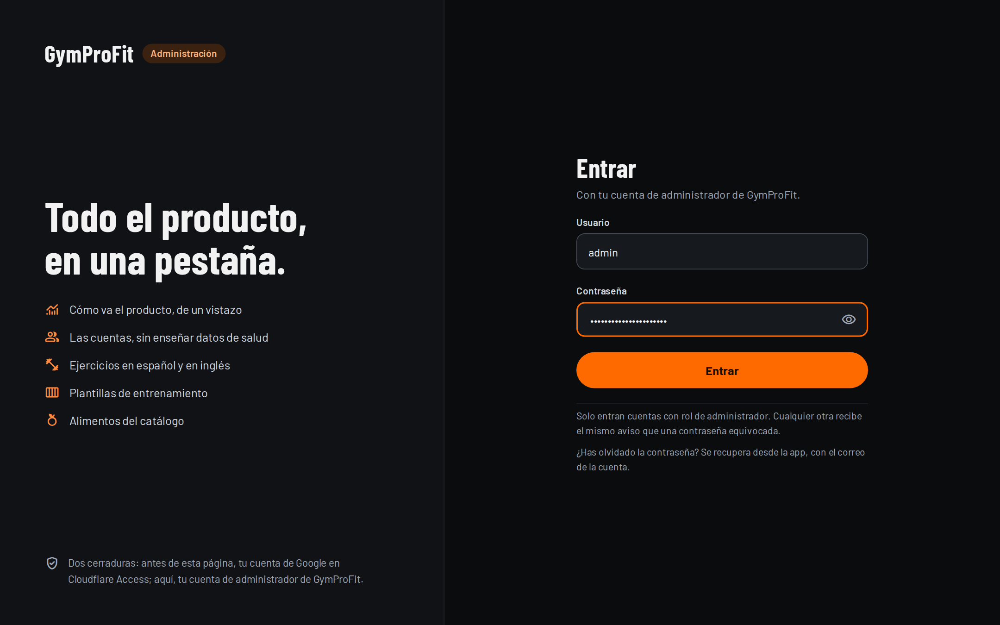
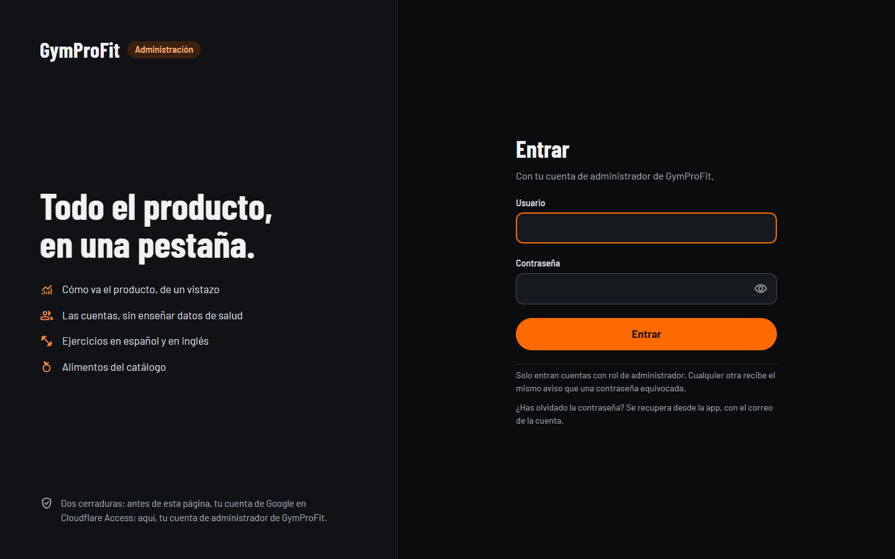
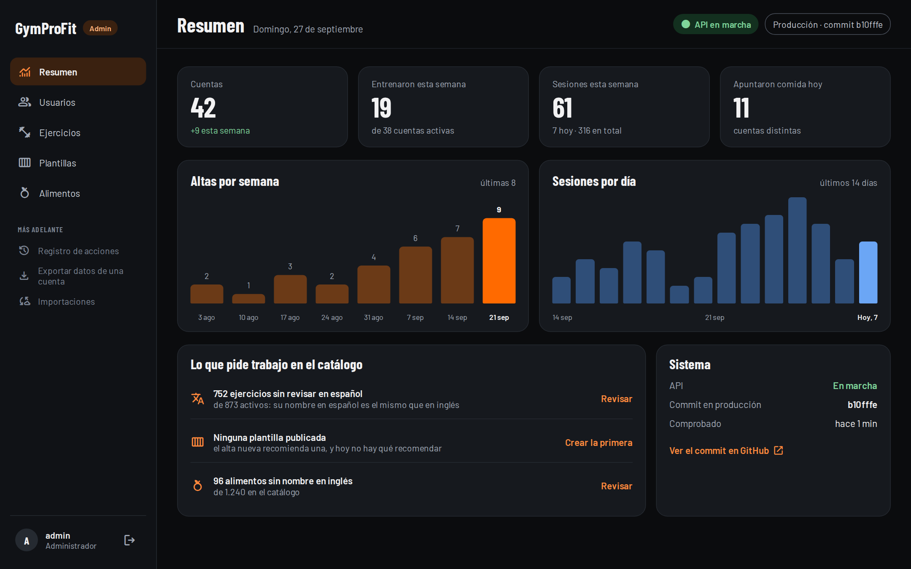
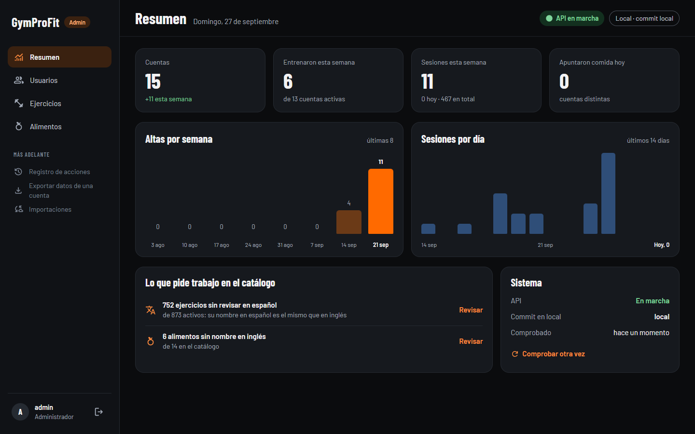
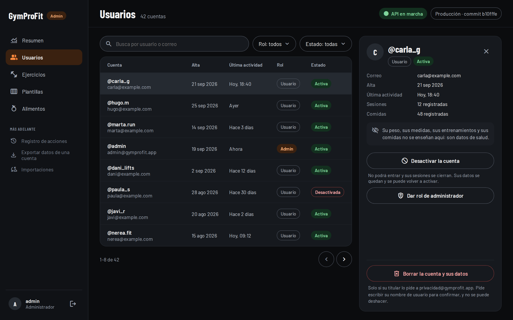
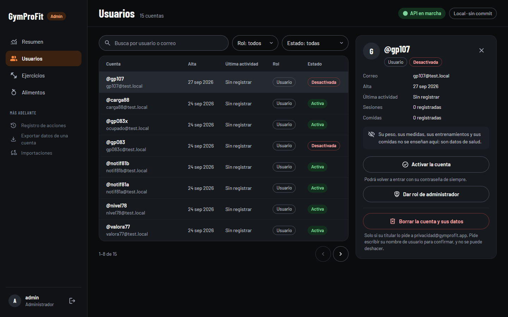
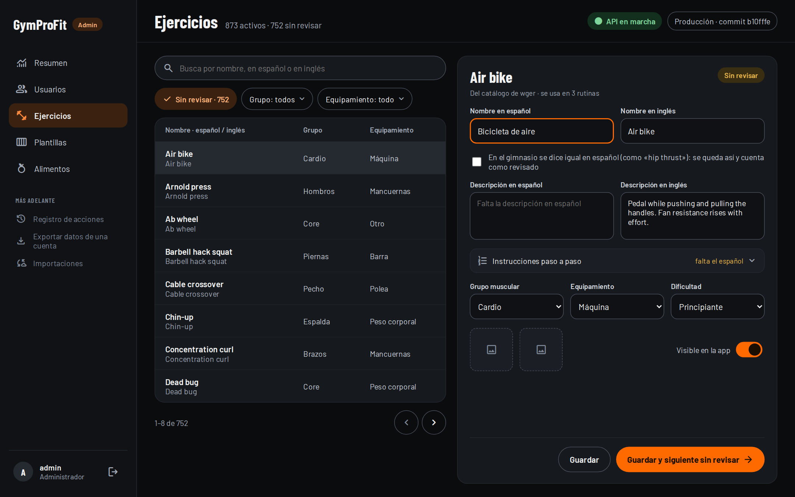
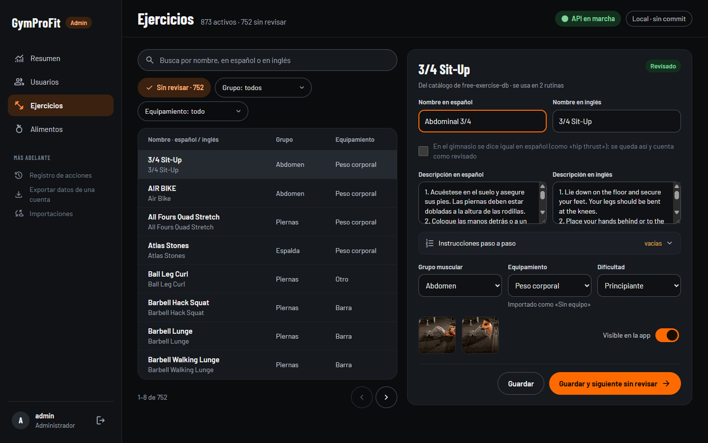
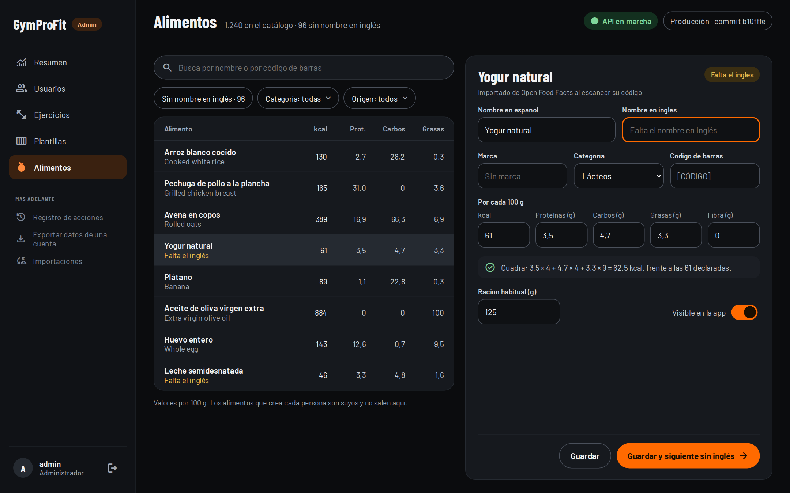
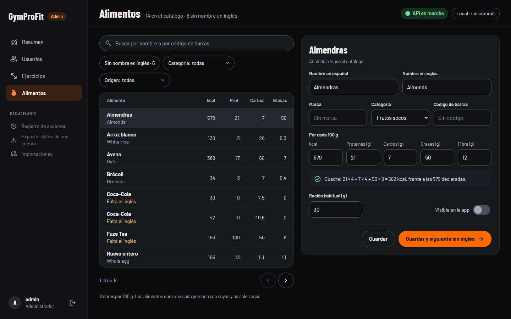

# Web de administración, fase 1 (GP-085) y errores en español (GP-109)

2026-09-27. Rama `feat/admin-web-fase-1`, desde `main` en `c264986` (la 1.1.0 entregada).
Decisión nueva: **DEC-035** (dónde vive la web, las dos cerraduras, tokens en memoria, nunca
toca la base). Capturas en [`2026-09-27-admin-fase-1/`](2026-09-27-admin-fase-1/).

**Estado del despliegue: la API NO está desplegada.** La rama está subida, pero llevarla a
`main` —que es de donde despliega Render— lo bloqueó el control de permisos de la sesión
(«fusión sin revisión»), y lo decide el propietario. Hasta entonces no se ha podido comprobar
`/api/actuator/info` ni el CORS de producción con curl (ver *Comprobación*). La web tampoco
está desplegada: eso lo hace Workers Builds cuando el propietario conecte el repositorio
(pasos en [`admin/README.md`](../../admin/README.md)).

## Commits

| Commit | Tarea | Qué |
|---|---|---|
| `e6f0bb7` | GP-109 | API · errores en español por defecto y en inglés con `Accept-Language: en` |
| `102462c` | GP-085 | API · CORS de producción solo para `https://admin.gymprofit.app` |
| `05db066` | GP-085 | API · `/admin/cuentas`: lista, ficha, último acceso y borrado a petición |
| `beeaa90` | GP-085 | API · `/admin/ejercicios`: equipamiento como lista cerrada y nombre revisado |
| `aad81cb` | GP-085 | API · `/admin/alimentos`: solo el catálogo; el PATCH de siempre gana tres campos |
| `e34bae9` | GP-085 | API · `/admin/resumen`, en hora de Madrid |
| `83f70f6` | GP-085 | API · la opción de equipamiento lleva `valor` (lo pedía `DtoSinSecretosEnToStringTest`); tabla de rutas en el README de la API |
| `557b5bb` | GP-085 | API · alta y último acceso con su zona |
| `c9ae39f` | GP-085 | Web · `admin/` entera, con el diseño en `documentacion/diseno/2026-09-27-administracion` |
| `1894997` | GP-085 | Web · la cabecera deja de decir «API en marcha» cuando no contesta |

Tests: **API 685** (`mvnw -B verify` en verde; 634 tras GP-109, 625 antes de empezar).
**Web 26** (Vitest). `tsc -b` y `vite build` limpios.

## Cada test nuevo, visto en rojo

- **GP-109** `IdiomaErroresTest` contra `c264986` (en un worktree): 5 de 7 en rojo. Los otros
  dos ya se cumplían antes: el inglés del proveedor de validación con la cabecera, y el
  francés, que caía al texto español a fuego del manejador. `ClavesErrorTest`: rojo quitando
  una clave de `messages_en`.
- **CORS** contra `c264986`: `ConfiguracionProdPropertiesTest` rojo y `CorsProduccionTest` 2 de
  3 (el «otro origen» ya se rechazaba).
- **Cuentas** por mutación: sin los 409/400 y sin apuntar el último acceso, 3 rojos; con la
  regla `/admin/**` abierta a cualquiera autenticado, el de USER e invitado rojo. La fecha
  sin zona hace rojo el test del formato.
- **Ejercicios**: sin el reescrito de «barra de dominadas» en el relleno, 2 casos rojos; sin
  «nombre distinto ⇒ revisado», rojo.
- **Alimentos**: sin `usuario IS NULL` en la consulta, rojos el de los alimentos personales y
  el de filtros; sin la comprobación del código repetido, 500 en vez de 409.
- **Resumen**: verde también con la JVM en UTC (como Render). Sin la conversión de zona y sin
  el filtro de completadas, rojos `altas` y `actividad` en UTC.
- **Web**: mutando el cliente (sin comprobar ADMIN, reintento sin límite, renovación sin
  compartir) y el umbral de calorías (`>=` y `OR`), 7 de 21 rojos; el test de Entrada, rojo sin
  comprobar ADMIN; `EstadoApi.test`, rojo sin el aviso de «sin respuesta».

## A · API

**GP-109.** Los mensajes dejan de escribirse en el `throw`: cada excepción lleva una clave de
`messages.properties` / `messages_en.properties` y sus argumentos, y el manejador la resuelve
en el idioma de la petición. `spring.web.locale=es`: sin cabecera, español (antes mandaba el
idioma del servidor, inglés en Render). Se quitaron los constructores con texto libre, así que
un mensaje sin clave no compila, y `ClavesErrorTest` exige cada clave en los dos idiomas. Los
de validación de los DTO usan `{clave}`; los del proveedor (Hibernate Validator) salen en su
traducción. El 401 del punto de entrada y el 429 del limitador, que corren antes de Spring MVC,
sacan el idioma de la propia petición.
Efecto lateral a saber: un cliente sin `Accept-Language` recibe ahora el **catálogo** en
español (los mapeadores ya elegían idioma por la cabecera). La app siempre la manda; el bot de
Discord, si no la manda, pasa de inglés a español.

**Cuentas.** `ultimo_acceso` (`V202609271200`) se pone al entrar y al renovar. Las fechas de
cuenta salen con zona: en la base van en el reloj del servidor (UTC en Render).
`DELETE /admin/cuentas/{id}` reutiliza el borrado de GP-008 (`BorradoCuentaService.borrarCuenta`,
separado de la comprobación de contraseña); `BorradoCuentaTest` lo prueba con todas las tablas
sembradas. El log: `cuenta id=…, por el administrador id=…, motivo: …`.

**Ejercicios.** `equipamiento` y `nombre_revisado` (`V202609271300`, columnas;
`V202609271301`, relleno, separado para poder re-ejecutarlo en el test). `equipo_necesario` no
se toca. «Sin revisar» es activo y con `nombre_revisado` falso: 752 al migrar, que es la cifra
de DEC-020. `nombre_revisado` se puso a true donde el español ya era distinto del inglés sin
contar mayúsculas ni tildes, o donde no hay inglés (0 casos en local).

**Mapeo del equipamiento** (valores distintos de `equipo_necesario` en la base local, 1 527
ejercicios, activos o no). Con varios aparatos manda el primero de barra → mancuernas →
kettlebell → polea → máquina → banda → peso corporal; la barra de dominadas es peso corporal;
lo demás, OTRO. La consulta está en la migración y se aplica igual a producción, cuyos valores
no se han podido ver desde aquí (vienen de la misma importación).

| `equipo_necesario` | Equipamiento | Ejercicios |
|---|---|---|
| Sin equipo | PESO_CORPORAL | 657 |
| Barra | BARRA | 224 |
| Mancuernas | MANCUERNAS | 222 |
| Polea | POLEA | 109 |
| Máquina | MAQUINA | 86 |
| Kettlebell | KETTLEBELL | 66 |
| Banda elástica | BANDA | 30 |
| Barra Z | BARRA | 22 |
| Balón medicinal | OTRO | 18 |
| Banco | OTRO | 12 |
| Fitball | OTRO | 12 |
| Rodillo de espuma | OTRO | 11 |
| Banco, Mancuernas | MANCUERNAS | 9 |
| Barra de dominadas | PESO_CORPORAL | 8 |
| Banco inclinado | OTRO | 8 |
| Esterilla | PESO_CORPORAL | 7 |
| Barra, Banco | BARRA | 6 |
| Barra, Mancuernas | BARRA | 3 |
| Mancuernas, Banco inclinado | MANCUERNAS | 3 |
| Barra, Banco, Mancuernas | BARRA | 2 |
| Esterilla, Sin equipo | PESO_CORPORAL | 2 |
| Banda elástica, Sin equipo | BANDA | 1 |
| Banco, Mancuernas, Kettlebell, Sin equipo | MANCUERNAS | 1 |
| Barra, Mancuernas, Barra de dominadas | BARRA | 1 |
| Barra y banco · Barra, Banco inclinado · Banco, Barra Z | BARRA | 3 |
| Barra de dominadas, Sin equipo · Barra dominadas | PESO_CORPORAL | 2 |
| Cinta de correr | MAQUINA | 1 |
| Banco, Banco inclinado | OTRO | 1 |

(«Sin equipo» junta tres textos ingleses de la importación: *Bodyweight*, *No equipment* y
*none (bodyweight exercise)*; «Polea», *Cable* y *Cable machine*.)

**Alimentos.** `GET /admin/alimentos` solo da filas sin dueño. `PATCH /alimentos/{id}` gana
`nombreEn`, `marca` y `barcode`, opcionales: sin ellos se comporta igual; un código que ya es
de otro alimento, 409.

**Resumen.** Días y semanas de lunes a domingo en hora de Madrid. `fecha_registro` va en el
reloj del servidor y se convierte; la hora de una sesión o de una comida es la del teléfono y
se toma tal cual. Cuentan las sesiones completadas.

## B · La web

Capturas contra la API local (cuenta `admin` de la base local del 3308; la de producción no se
ha usado para nada), a 1440 × 900, al lado de su diseño:

| Diseño | Web |
|---|---|
|  |  |
|  |  |
|  |  |
|  |  |
|  |  |

Más: [cuenta USER rechazada](2026-09-27-admin-fase-1/01b-entrada-cuenta-user.png),
[dar rol](2026-09-27-admin-fase-1/03b-usuarios-dar-rol.png),
[borrar a petición](2026-09-27-admin-fase-1/03c-usuarios-borrar.png) y
[después](2026-09-27-admin-fase-1/03d-usuarios-borrada.png),
[«Guardar y siguiente sin revisar»](2026-09-27-admin-fase-1/04c-ejercicios-siguiente.png) (752 → 751),
[calorías que no cuadran](2026-09-27-admin-fase-1/06b-alimentos-no-cuadra.png),
[foco con teclado](2026-09-27-admin-fase-1/07-foco-teclado.png),
[1024 px](2026-09-27-admin-fase-1/08-resumen-1024.png), [390 px](2026-09-27-admin-fase-1/09-usuarios-390.png)
y [la API caída](2026-09-27-admin-fase-1/10-error-api-caida.png).

Diferencias con el diseño, a propósito:

- Sin Plantillas en la barra lateral ni su fila en el resumen (fase 2), como se pidió. Tampoco
  en la lista de Entrada («Plantillas de entrenamiento»): anunciaba algo que no existe.
- La ficha de una cuenta ADMIN no deja borrarla (la API da 409) y lo dice; la propia cuenta
  no ofrece desactivar, rol ni borrado. «Dar rol» pide confirmación en un diálogo.
- El editor de ejercicios lleva además el músculo principal en ES y EN, dentro del desplegable
  de instrucciones: la ruta lo guarda y el diseño no tenía sitio para él.
- Los filtros son `select` nativos con aspecto de píldora; en Ejercicios, con la cifra de «sin
  revisar» en el chip, el tercero baja de línea a 1440.
- Barlow 700 (botones) no estaba entre las fuentes de `web/`: se añadió desde el paquete OFL de
  Fontsource, con su licencia al lado.

Visto en el navegador y corregido antes de cerrar: el desplegable de instrucciones se veía
abierto (el CSS pisaba `hidden`), «commit local» se enseñaba como si fuera un hash, y la
cabecera seguía en verde con la API caída (`1894997`).

## Comprobación

- **Una cuenta USER no pasa de Entrada** (web: mismo aviso que una contraseña equivocada) **ni
  llamando a `/admin`** (curl a la API local con el token de `prueba`: 403 en `/admin/resumen`,
  `/cuentas`, `/cuentas/1`, `/ejercicios`, `/alimentos` y `DELETE /cuentas/1`; con
  `Accept-Language: en`, «Access denied»).
- **CORS**, en local con curl: `http://localhost:5173` → 200 con `Access-Control-Allow-Origin`;
  otro origen → 403 sin la cabecera. **El de producción no se ha podido comprobar**: exige que
  `main` lleve estos commits y que Render los despliegue. Tras el despliegue:

  ```bash
  curl -s https://api.gymprofit.app/api/actuator/info
  curl -s -o /dev/null -w "%{http_code}\n" -X OPTIONS https://api.gymprofit.app/api/admin/resumen \
       -H "Origin: https://admin.gymprofit.app" -H "Access-Control-Request-Method: GET"   # 200
  curl -s -o /dev/null -w "%{http_code}\n" -X OPTIONS https://api.gymprofit.app/api/admin/resumen \
       -H "Origin: https://ejemplo.com" -H "Access-Control-Request-Method: GET"          # 403
  ```

## Queda

- Llevar la rama a `main` (fusión o PR) para que Render despliegue A, y comprobar el commit y el
  CORS con los curl de arriba. Hay tres migraciones (`V202609271200`, `…1300`, `…1301`).
- Cloudflare: conectar el repositorio en Workers Builds, el dominio y Access (`admin/README.md`).
- Importaciones nuevas de ejercicios llegan con `equipamiento` OTRO: el mapeo solo está en la
  migración. Cuando se haga la pantalla de importaciones, llevarlo a Java.
- El CI no ejecuta los tests de la web, y un push que solo toque `admin/` lanza el de la API (y,
  en `main`, un redespliegue de Render con el mismo código). Valorar un job para `admin/` y
  `admin/**` en `paths-ignore`.
- Varias descripciones del catálogo son en realidad las instrucciones numeradas: es cosa de
  la importación, no de esta fase.
