# Lote 1.1.1 — remates de la barra (GP-118), borrado de cuenta (GP-119) y revisión de la web

2026-09-27. Rama `lote-1.1.1`, sacada de `feat/admin-web-fase-1` (decisión del propietario:
`main` todavía no lleva la web de administración). APK `GymProFit-1.1.1.apk` (versionCode
10101, misma clave: SHA-256 `91d141c2…d722fd`) en el escritorio, en lugar del de la 1.1.0;
etiqueta `v1.1.1` en `3710cc4`. **No necesita nada nuevo de la API**: funciona con la de
producción de hoy (`f8790e7`). Capturas en [`2026-09-27-lote-1.1.1/`](2026-09-27-lote-1.1.1/).

| Commit | Tarea | Qué |
|---|---|---|
| `5773f66` | GP-118 | App · el «+» de la barra se ve entero |
| `16a3ed3` | GP-118 | App · el engranaje de Progreso sin el anillo naranja |
| `af8ac28` | GP-119 | API · 403 con `PASSWORD_ACTUAL_INCORRECTA` al borrar la cuenta; app · recorta la contraseña; DEC-034 sin deuda |
| `4ab55ba` | GP-085 | Web · accesibilidad, errores y carga tras la auditoría |
| `3710cc4` | — | Versión 1.1.1 |

Tests: **API 685**, **app 125** (unitarios) + 2 instrumentados, **web 34**. Todos en verde.

## Cada test nuevo, visto en rojo

- `BarraNavegacionRecorteTest` (instrumentado, emulador API 36): el rectángulo visible del
  «+» medía **142 px de 147** con el layout anterior; 147 después. El segundo test de la
  clase fija que el botón sigue a −2 dp de su columna: arreglar el recorte no lo movió.
- `BotonRedondoTest`: rojo mientras el engranaje llevaba su fondo propio.
- `BorradoCuentaTest`: `$.cause` era `null`; ahora `PASSWORD_ACTUAL_INCORRECTA`.
- `EliminarCuentaActivityTest`: rojo con el método sin recortar.
- Web: 6 de los 8 nuevos en rojo contra el código anterior (los otros dos ya se cumplían).

## 1 · GP-118, el «+» recortado

El botón sube 2 dp (`marginTop -2dp`) por encima de su columna. Recortaban dos cosas a la vez
en `filaBarra`: `clipChildren`, que ceñía la columna a sus límites, y `clipToPadding`, que
cortaba a la altura del relleno de 8 dp. El `clipChildren="false"` de la columna solo evitaba
el tercer recorte, el de la columna al botón. Ahora `filaBarra` no recorta ni a sus hijos ni a
su relleno. La comprobación es la que se pidió: el rectángulo visible del botón, con todos los
recortes de sus padres, mide lo mismo que el botón.

## 2 · GP-118, el anillo del engranaje

Fuera `bg_boton_ajustes` (el círculo con el trazo naranja de 2 dp). El engranaje usa el fondo
del estilo `BotonRedondo`, como el resto de botones redondos de cabecera, y un test impide que
uno vuelva a cambiarlo.

| | Claro | Oscuro |
|---|---|---|
| ES · Inicio (barra) | 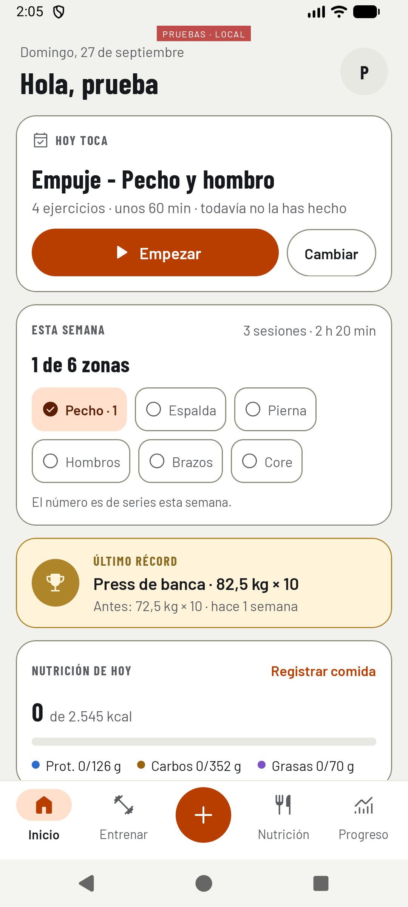 | 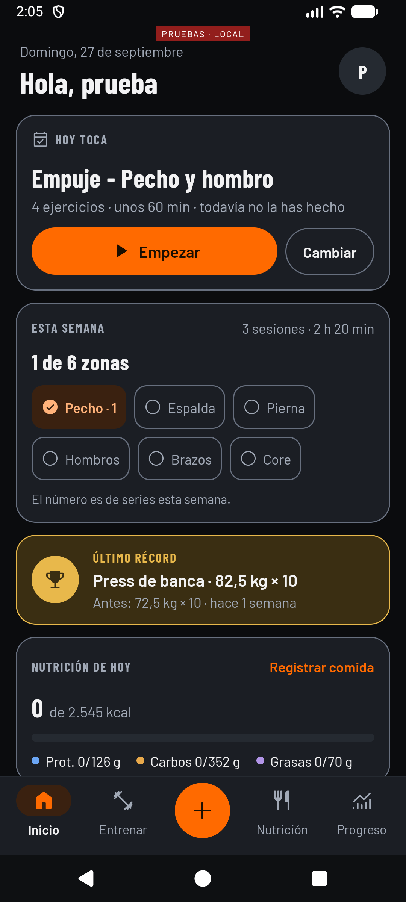 |
| EN · Inicio (barra) | 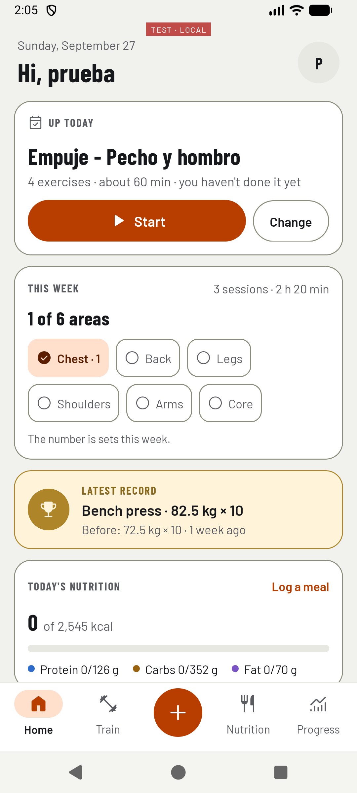 | 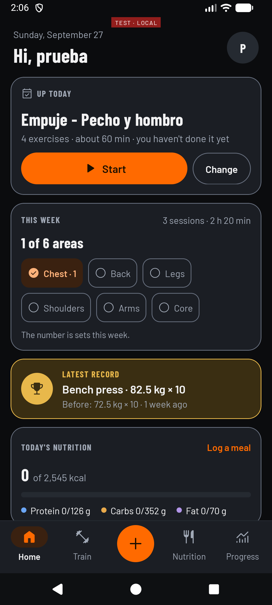 |
| ES · Progreso | 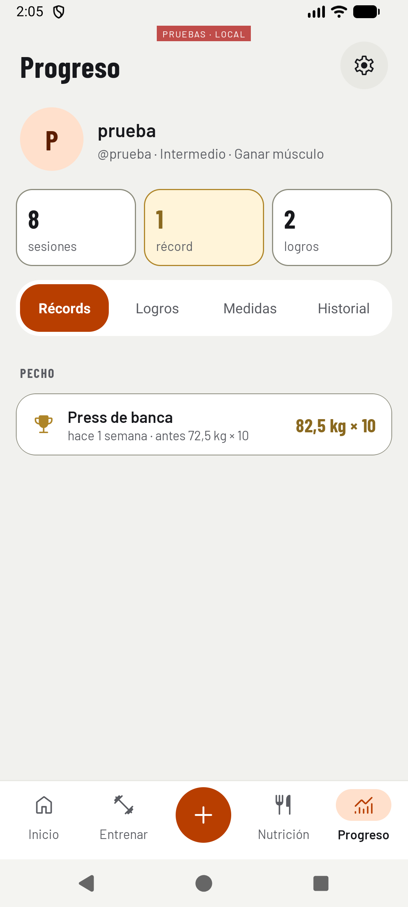 | 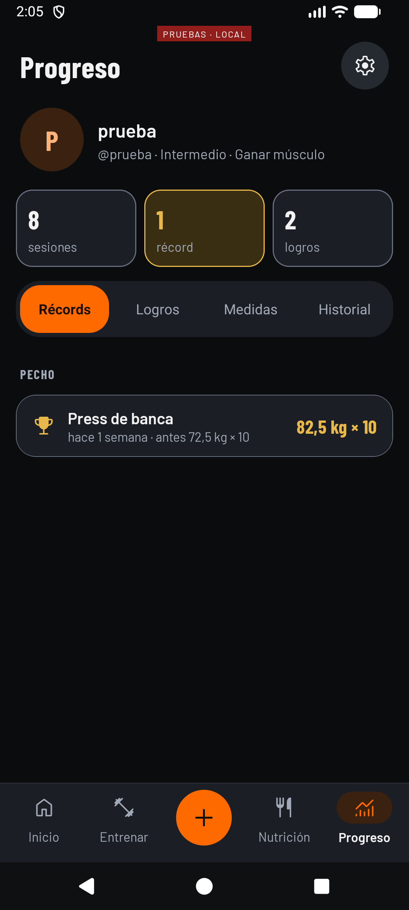 |
| EN · Progreso | 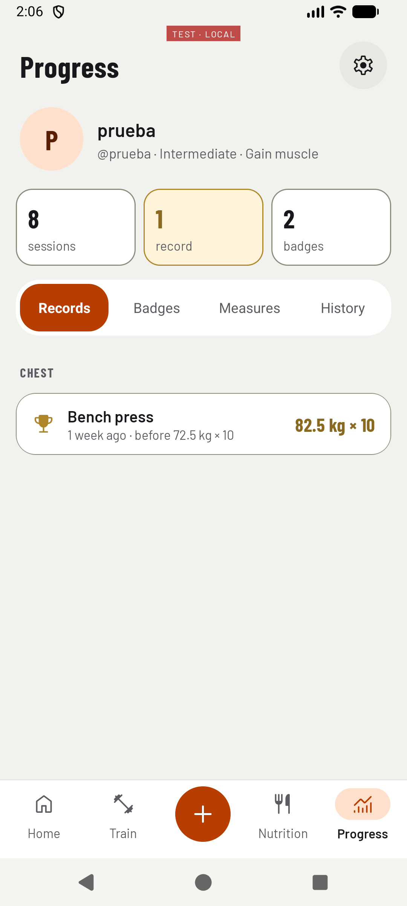 |  |

**Con la letra a 1,3:**

| | Claro | Oscuro |
|---|---|---|
| ES · Inicio | 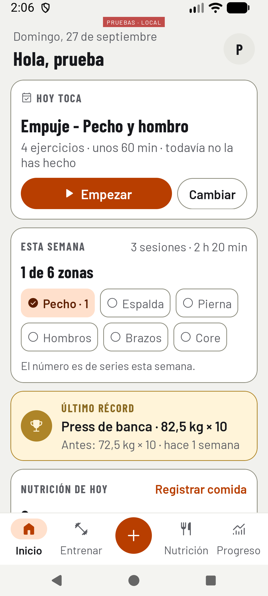 | 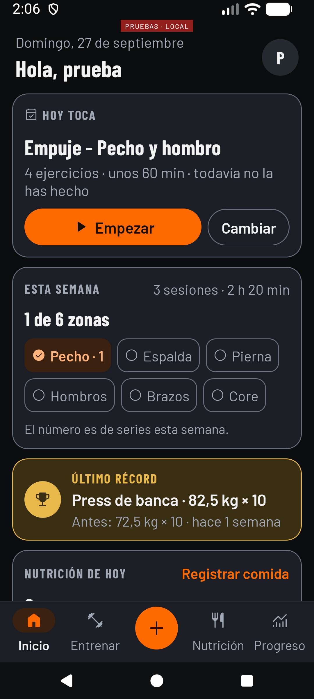 |
| EN · Inicio | 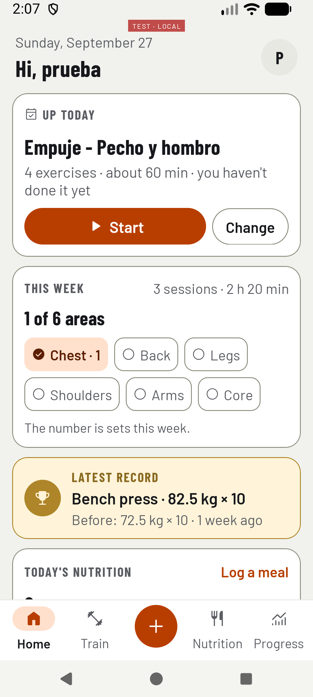 | 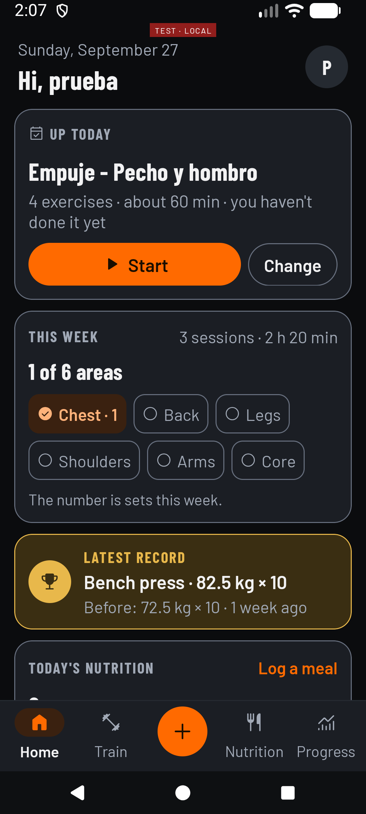 |
| ES · Progreso | 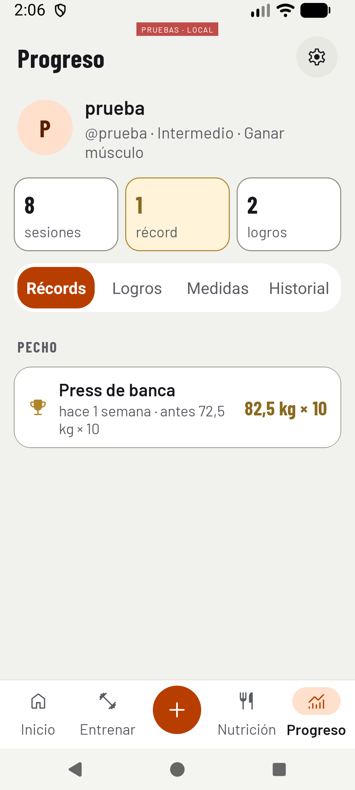 | 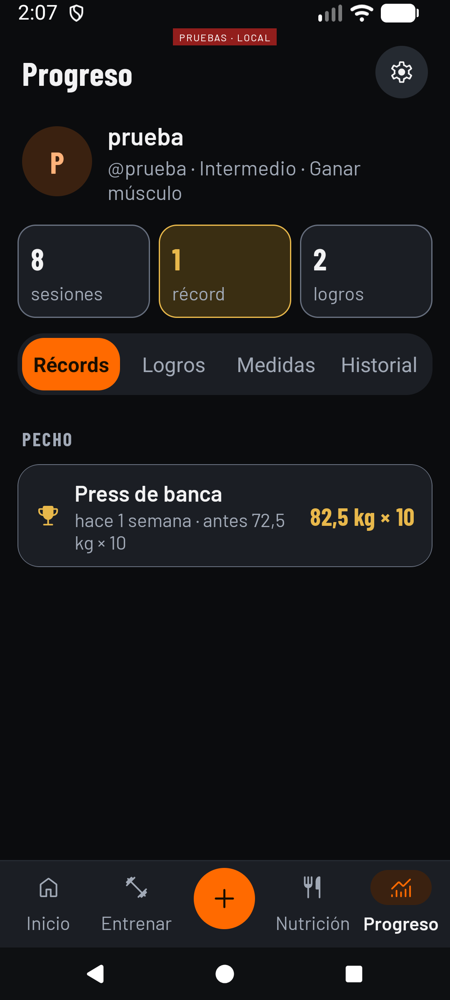 |
| EN · Progreso | 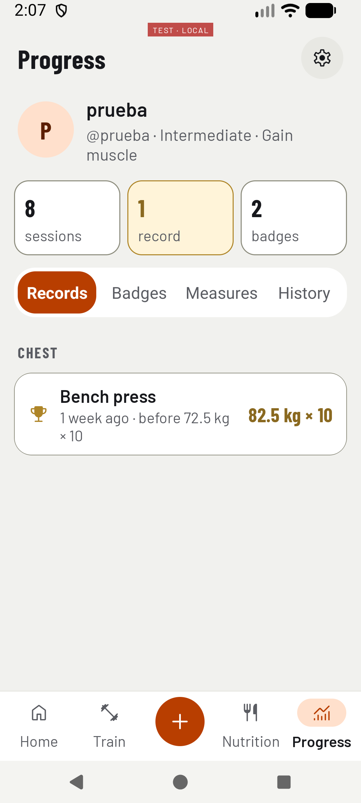 | 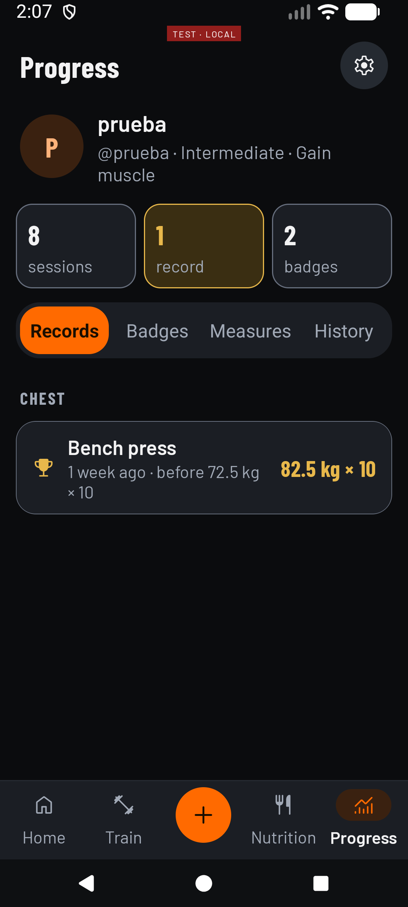 |

A 1,3 no se corta nada. Visto de paso, sin tocar: en el récord de Progreso, «antes 72,5 kg ×
10» parte la línea entre el número y «kg». Se arregla con un espacio duro; queda apuntado.

## 3 · GP-119, el borrado de cuenta

Con la contraseña equivocada, `DELETE /usuarios/me` responde 403 con
`PASSWORD_ACTUAL_INCORRECTA` en `cause`, como `POST /auth/change-password`. El estado no cambia:
las versiones repartidas siguen igual. La app recorta la contraseña antes de enviarla, como en
el resto de sitios. DEC-034 tacha la deuda que tenía anotada.

## 4 · GP-106

Nada que hacer: el detalle ya se publicó en `e8e6b7e` («detalle de GP-106, ya desplegado»),
después de que el propietario confirmara Flyway en `v202609271100`.

## 5 · Web de administración: Impeccable, audit y harden

El detector automático no encontró nada (0 hallazgos). Revisión a mano:

| # | Dimensión | Antes | Hallazgo principal |
|---|---|---|---|
| 1 | Accesibilidad | 3 | `aria-selected` en filas de una tabla que no es `grid`; chips y filtros de 40 px |
| 2 | Rendimiento | 3 | Un solo paquete de 340 kB para todo, también para Entrada |
| 3 | Responsive | 3 | Bien a 1024 y a 390; las tablas se desplazan dentro de su marco |
| 4 | Temas | 3 | Cinco colores sueltos fuera de los tokens; solo tema oscuro (lo pide el diseño) |
| 5 | Integridad | 4 | Coherente con el diseño aprobado; el detector sin hallazgos |
| | **Total** | **16/20** | **Bien** |

**Arreglado** (`4ab55ba`, sin cambiar lo que se ve):

- **Accesibilidad.** La fila abierta se anuncia en su botón (`aria-current`) y no con
  `aria-selected`. Cada pantalla pone su título al documento («Ejercicios · GymProFit Admin»).
  Chips y filtros siguen midiendo 40 px, pero su zona pulsable llega a 44. Cada diálogo tiene
  su propio id de título (la ficha de una cuenta tiene dos). Fuera una región viva duplicada.
- **Errores y vacío.** Un aviso de error ya no se va solo a los 5 s (WCAG 2.2.1) y puede traer
  «Reintentar». Si el resumen de Ejercicios o de Alimentos no carga, se dice (antes faltaban la
  cabecera y las opciones de un filtro sin avisar). Si falla la descarga de una pantalla, se
  ofrece recargar en vez de dejarla en blanco. Elegir otra fila con cambios sin guardar en un
  editor pregunta antes, y cerrar o recargar la pestaña también (recargar cierra la sesión).
- **Rendimiento** (medido antes y después, DEC-021). Cada pantalla del panel se descarga al
  abrirla: el paquete inicial pasa de **340,04 kB a 294,35 kB** (103,94 → 93,10 kB en gzip,
  −10 %); cada pantalla pesa entre 6 y 13 kB. El estado de la API deja de preguntarse con la
  pestaña oculta.
- **Temas.** Los cinco colores sueltos pasan a tokens. `tsconfig.tsbuildinfo`, un artefacto de
  compilación, sale del repositorio (entró por error en la fase 1).

Visto en el navegador contra la API local: [Ejercicios tras el cambio](2026-09-27-lote-1.1.1/web-ejercicios-tras-harden.png),
idéntica a la aprobada.

**Para decidir** (cambian el aspecto aprobado o piden dependencias, así que no se han tocado):

1. **[P1] Borde de los campos a 2,3:1.** `--borde-control` (#4A505B) sobre el fondo del campo
   no llega al 3:1 que WCAG 1.4.11 pide a los componentes de interfaz. Subirlo a ~#6B7280 lo
   arregla; se nota en todos los campos y filtros.
2. **[P2] Barras de las gráficas a menos de 3:1.** Las de altas (#6B3A17, 1,9:1) y las de
   sesiones (#2F4E78, 2,1:1) sobre la tarjeta. Las altas llevan su número encima y las dos
   gráficas tienen su descripción para lectores de pantalla, así que no se pierde información,
   pero la forma se ve poco. Aclarar los dos tonos.
3. **[P2] Salir de una pantalla por la barra lateral no avisa de cambios sin guardar.** Hace
   falta el bloqueo de navegación de React Router, que solo existe con su «data router»
   (`createBrowserRouter`): es cambiar cómo se montan las rutas, no una dependencia nueva, pero
   toca toda la app. Hoy avisan cambiar de fila y cerrar la pestaña.
4. **[P2] Campos obligatorios sin marca.** El nombre en español es obligatorio en los dos
   editores y solo se sabe al guardar. Añadir «(obligatorio)» a la etiqueta cambia el texto
   aprobado.
5. **[P3] Solo tema oscuro.** El diseño es oscuro; la app tiene los dos. Para una herramienta
   de escritorio de un solo usuario no parece urgente.
6. **[P3] Los tests de la web no corren en CI**, y un push que solo toque `admin/` lanza el CI
   de la API. Un job para `admin/` y `admin/**` en `paths-ignore` lo resuelven; es un cambio de
   workflow (`ci`).

## 6 · Entrega

APK `GymProFit-1.1.1.apk` en el escritorio; etiqueta `v1.1.1` subida. La rama `lote-1.1.1`
está subida y apila sobre `feat/admin-web-fase-1`: al fusionar, entran las dos.
